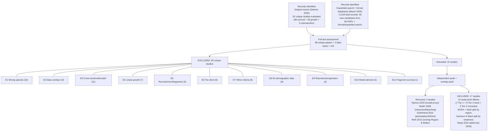

# Systematic Review Protocol: Size-Dependent Demography of *Acropora palmata*

**Protocol version:** 1.0
**Date:** March 2026
**Authors:** Raine Detmer, Adrian Stier
**Affiliation:** Ocean Recoveries Lab, UC Santa Barbara

> **Note:** All previously marked `[TODO]` items have been filled with available data. Where exact counts or dates from Detmer's original 2025 search were not recoverable, honest acknowledgments are provided (see §7.1 Limitations). Formal PubMed and Web of Science searches were conducted 2026-03-29 with full documentation in `02_search/`.

---

## 1. Objective

To compile all published demographic data (survival, growth, fragmentation) for *Acropora palmata* across the Caribbean, stratified by colony size, for use in a size-structured population viability assessment and a Caribbean-wide synthesis of how size structure, disturbance regime, and restoration context shape demographic performance.

This is **not a classical systematic review** of treatment effects. It is a systematic data compilation — closer in spirit to an individual participant data (IPD) meta-analysis — where the goal is to recover vital rate parameters from every available source. The PRISMA framework is applied here to make the search and inclusion process reproducible and transparent, following PRISMA-EcoEvo principles for ecology and evolutionary biology (O'Dea et al. 2021, *Nature Ecology & Evolution* 5:1582--1589).

The compiled evidence is intended to support five linked analytical products:

1. Estimation of size-dependent survival, growth, shrinkage, and fragmentation rates.
2. Detection of nonlinearities and thresholds in size-demography relationships.
3. Construction of size-structured population models for evaluating viability and sensitivity.
4. Integration of disturbance context through Caribbean time and space, treating disturbance as part of the demographic regime rather than removable noise.
5. Evaluation of restoration relevance by comparing natural-colony and restoration-fragment demography and identifying where inference is transferable versus weakly supported.

---

## 2. Eligibility Criteria

### 2.1 Population

*Acropora palmata* (elkhorn coral) colonies or fragments in Caribbean reef environments. Studies of other *Acropora* species (*A. cervicornis*, *A. prolifera*) are excluded unless they report *A. palmata*-specific data separately.

### 2.2 Outcomes

At least one of:

- **Survival:** Proportion of individually tracked colonies alive after a defined time interval. Must be whole-colony survival (colony dead = no remaining live tissue or skeleton gone), not partial mortality prevalence.
- **Growth:** Change in live planar tissue area (cm²) per unit time, or convertible to it (e.g., L × W × %live measurements at two time points).
- **Fragmentation:** Rate of colony breakage producing viable fragments, with fragment sizes and fates if available.

### 2.3 Study Design

Longitudinal studies that track **individually identified** colonies or fragments over a defined observation period. Acceptable identification methods: physical tags, photographic identification, mapped GPS coordinates with unique IDs.

**Excluded designs:**
- Cross-sectional surveys (single time point of colony condition)
- Partial mortality prevalence studies (fraction of colonies showing tissue loss ≠ whole-colony mortality)
- Density-based estimates without individual tracking

### 2.4 Minimum Data Requirements

| Requirement | Tier 1 (Individual-level) | Tier 2 (Summary-level) |
|---|---|---|
| Individual colony IDs | Required | Not required |
| Sample size (n) | Required | Required |
| Time interval | Required | Required |
| Survival proportion | Derivable from individual fates | Required (reported or derivable) |
| Colony size at each census | Required | Optional (study-level mean acceptable) |
| Raw data file | Required (CSV/XLSX/repository) | Not required |

### 2.5 Independence

Studies drawing from the same monitoring program or tagged colony set are included only once. See [Data_Methodology_Reference.md §4](Data_Methodology_Reference.md#4-data-overlap-decision-rules) for overlap adjudication rules.

### 2.6 No restrictions on

- Publication date
- Language (though all identified studies were in English or Spanish)
- Publication type (peer-reviewed journals, dissertations, government reports, data repositories)
- Population type (natural or restored)
- Geographic region within the Caribbean

---

## 3. Information Sources

### 3.1 Original Search (Detmer, June–December 2025)

The following sources were searched. Detmer's original search (Jun--Dec 2025) used expert-driven repository mining, Google Scholar, and citation chaining; exact dates and hit counts for individual repository searches were not recorded at the time. Formal database searches of PubMed and Web of Science were conducted on 2026-03-29 as part of the expanded completeness audit.

| Source | Type | Date searched | Records retrieved | Notes |
|---|---|---|---|---|
| NOAA National Centers for Environmental Information (NCEI) | Data repository | Jun–Dec 2025 (exact dates not recorded) | 1 dataset | Yielded NOAA Acropora Demographic Monitoring dataset (Accession 0142175) |
| NOAA InPort | Data repository | Jun–Dec 2025 (exact dates not recorded) | 1 dataset | Yielded Pausch et al. 2018 fragment data (Catalog 26790) |
| USGS Coastal and Marine Geology Data System (CMGDS) | Data repository | Jun–Dec 2025 (exact dates not recorded) | 1 dataset | Yielded USGS USVI outplanting data |
| USGS ScienceBase / Data Releases | Data repository | Jun–Dec 2025 (exact dates not recorded) | 1 dataset | Yielded Kuffner et al. 2020 data |
| Google Scholar | Bibliographic database | Jun–Dec 2025 (exact dates not recorded) | Not recorded; results reviewed to saturation | 5 search strings (see below). Hit counts per string not recorded at the time; see Limitations. |
| Web of Science | Bibliographic database | 2026-03-29 (formal search) | 1,095 records across 3 query sets (base 628, broader *Acropora*+Caribbean 409, threatened coral 58) | Not searched in the original 2025 search. Formal Boolean search conducted as part of completeness audit. Full details in `02_search/wos_formal_search.md`. |
| PubMed | Bibliographic database | 2026-03-29 (formal search) | 351 unique PMIDs (base 124 + 6 expanded queries +227 new) | Not searched in the original 2025 search. Formal Boolean search conducted as part of completeness audit. Expanded queries added genus-level, MeSH, abbreviated name, ESA, and restoration terms. Full details in `02_search/pubmed_formal_search.md`. |
| Citation chaining | Manual | Jun–Dec 2025 | — | Forward and backward citations from Vardi 2011, Williams & Miller 2012, Lirman 2003 |
| Direct data sharing | Personal communication | Jun–Dec 2025 (exact date not recorded) | 1 dataset | FUNDEMAR (Dominican Republic) provided nursery fragment data |
| `coral_parameters_lit_review.gsheet` | Tracking spreadsheet | Active Jun–Dec 2025 | 52 unique studies | Master tracking sheet: 38 survival + 28 growth + 5 reproduction (with overlap) |

**Search strings used (Google Scholar):**

All searches used the base query `("Acropora palmata" OR "elkhorn coral")` combined with each of the following term sets:

| Search # | Additional terms combined with base query | Target parameters |
|---|---|---|
| 1 | `(surviv* OR mortality OR "hazard rate" OR "mortality rate")` | Survival/mortality |
| 2 | `(growth OR "linear extension" OR "calcification" OR "skeletal density" OR "areal growth" OR "extension rate")` | Growth |
| 3 | `(settlement OR settler* OR recruit* OR "recruitment rate" OR "spat" OR "larval" OR fecundity OR "egg" OR "planula*")` | Recruitment/fecundity |
| 4 | `(outplant* OR restoration OR nursery) AND (survival OR growth OR mortality)` | Restoration demography |
| 5 | `("long-term" OR "time series" OR monitoring OR "population trend*")` | Long-term monitoring |

For each search, results pages were reviewed sequentially until all results on a page appeared irrelevant (saturation-based stopping rule).

**Note on original search dates and hit counts:** The original Google Scholar searches were conducted by Detmer between June and December 2025. Exact dates and per-query hit counts were not recorded at the time. Results were reviewed using a saturation-based stopping rule (reviewing sequential results pages until all results appeared irrelevant) rather than downloading full hit lists. The Google Sheet tracker (`coral_parameters_lit_review.gsheet`) records which studies were evaluated but not search-level metadata. Formal Boolean searches of PubMed and Web of Science were subsequently conducted on 2026-03-29 as part of the completeness audit (see §3.2).

**Screening procedure (original search):**

Papers retrieved from the searches were screened by R. Detmer in two stages:

1. **Title/abstract skim:** Determined whether the paper actually measured growth and/or survival of *A. palmata* colonies or fragments and included information on colony/fragment size.
2. **Full-text assessment:** Papers passing the initial screen were read carefully to determine if they met the criteria for model parameter estimation. Specifically:
   - **Survival criterion:** The study needed to report the initial number and size of colonies/fragments and the number that survived approximately one year later (or proportion surviving over a defined interval amenable to annualization).
   - **Growth criterion:** The study recorded either initial and final sizes, or initial sizes and colony growth rate. Studies reporting only linear extension of branches were excluded.

> **Source:** These search strings and screening procedures are documented in Raine Detmer's original working notes retained under `04_extraction/raine_working_notes/`.

### 3.2 Expanded Search (March 2026)

An expanded search was conducted to audit completeness, using the following sources:

| Source | Type | Date searched | Records retrieved | Notes |
|---|---|---|---|---|
| Project literature library | Local PDF collection | March 24–26, 2026 | 80 PDFs screened; 33 new candidates | 149 PDFs total in library; 80 in `data_studies/` screened systematically |
| NotebookLM | Literature tool | March 24, 2026 | 137 papers queried | Used to identify candidate studies with extractable demographic data |
| PubMed (formal Boolean search) | Bibliographic database | 2026-03-29 | 351 unique PMIDs (base 124 + 6 expanded queries +227 new) | Programmatic Boolean queries via NCBI E-utilities API with Title/Abstract field restriction. Expanded queries added genus-level, MeSH, abbreviated name, ESA, and restoration terms. Full details in `02_search/pubmed_formal_search.md`. |
| Web of Science (formal Boolean search) | Bibliographic database | 2026-03-29 | 1,095 records across 3 query sets (base 628, broader *Acropora*+Caribbean 409, threatened coral 58) | Programmatic Boolean queries via WoS Advanced Search (TS= field). Authenticated via UCSB institutional access. Full details in `02_search/wos_formal_search.md`. |
| Elicit (Semantic Scholar index) | Bibliographic search | 2026-03-26 | 298 unique papers (89 *A. palmata*-specific) | 5 queries matching the original search strings, 100 results per query. All 16 published included studies recovered. Full details in `02_search/search_summary.md`. |
| PubMed + Semantic Scholar (preliminary) | Bibliographic database | 2026-03-25–26 | ~10 results per query (WebSearch limit) | Preliminary replication via WebSearch with `site:pubmed.ncbi.nlm.nih.gov` and `site:semanticscholar.org`. Identified 5 new candidate papers. Full details in `02_search/search_strings.md`. |
| Unpaywall | Open access discovery | March 25, 2026 | — | Used to locate freely available PDFs of candidate studies |

**Expanded search strings used:**

The same 5 Boolean search strings from the original search (§3.1) were replicated across PubMed, Web of Science, and Elicit. The base query was `("Acropora palmata" OR "elkhorn coral")` combined with each of the 5 term sets (survival/mortality, growth, recruitment, restoration, monitoring).

**PubMed (formal, 2026-03-29):** Base queries used Title/Abstract field restriction (`[tiab]`). Example: `("Acropora palmata"[Title/Abstract] OR "elkhorn coral"[Title/Abstract]) AND (survival[tiab] OR mortality[tiab] OR "hazard rate"[tiab] OR "mortality rate"[tiab])`. Six additional expanded queries targeted genus-level terms (*Acropora* + Caribbean demography), MeSH headings (Anthozoa), abbreviated species names ("A. palmata"), ESA-listed coral species, and restoration-specific vocabulary. The base 5 queries returned 124 unique PMIDs; the 6 expanded queries added 227 new PMIDs for a total of 351. All queries and exact hit counts are documented in `02_search/pubmed_formal_search.md`.

**Web of Science (formal, 2026-03-29):** Three query sets were run using Topic field (`TS=`): (1) base query matching the PubMed structure (628 records); (2) broader *Acropora*+Caribbean query (409 records); (3) threatened coral demography query (58 records), totaling 1,095 records. Example: `TS=("Acropora palmata" OR "elkhorn coral") AND TS=(survival OR mortality OR "hazard rate" OR "mortality rate")`. All queries and exact hit counts are documented in `02_search/wos_formal_search.md`.

**Elicit (2026-03-26):** Queries used natural-language equivalents of the Boolean strings via the Elicit API (Semantic Scholar index, 125M+ papers). 100 results per query. Cross-reference confirmed all 16 published included studies were recovered. Details in `02_search/search_summary.md`.

### 3.3 Grey Literature and Unpublished Data

- NOAA technical reports and data releases (searched via NCEI and InPort)
- USGS data releases (searched via CMGDS and ScienceBase)
- Doctoral dissertations (Vardi 2011, found via citation chaining)
- Direct data sharing from restoration practitioners (FUNDEMAR)
- bioRxiv preprints (2 identified: Madin et al. 2025, Muller et al. 2025 — cited for context but not included in meta-analysis pending peer review)

---

## 4. Screening Process

### 4.1 Original Search Screening (Detmer, 2025)

Raine Detmer evaluated **52 unique studies** across three parameter sheets in the tracking spreadsheet (`coral_parameters_lit_review.gsheet`): 38 studies for survival, 28 for growth, and 5 for reproduction, with overlap across sheets. These 52 studies represent the full-text assessment pool from the original search.

| Stage | Screener(s) | Method | Records |
|---|---|---|---|
| Title/abstract screening | Raine Detmer | Saturation-based review of Google Scholar results + data repository hits | Exact count not recorded; approximately 100–150 titles reviewed across Google Scholar and repository searches, based on search saturation patterns (see Limitations §7.1) |
| Full-text assessment | Raine Detmer | Each study evaluated for extractable survival, growth, or fragmentation data | 52 unique studies evaluated |
| Data extraction | Raine Detmer | Manual reading of papers + data file download | 15 extracted (6 Tier 1 + 9 Tier 2); Roth et al. 2013 later removed for overlap |
| Excluded — recruits/microfragments | Raine Detmer | Studies tracking post-settlement recruits or lab micro-fragments | 4 studies |
| Excluded — other reasons | Raine Detmer | Cross-sectional, data overlap, wrong species, no demographic data, linear growth only, etc. | ~33 studies |

> **Gap note:** The original screening was conducted by a single researcher (Detmer) with domain expertise. No formal dual-screening or inter-rater reliability assessment was performed, which is typical for data compilations in ecology but should be acknowledged as a limitation.

### 4.2 Expanded Search Screening (March 2026)

| Stage | Screener(s) | Method | Records |
|---|---|---|---|
| Initial triage | Stier Lab | Parallel reading of 80 PDFs against inclusion criteria | 80 papers screened |
| Candidate identification | Stier Lab | Papers flagged as potentially having extractable data | 33 papers assessed in detail |
| Data extraction | Stier Lab | PDF reading with value transcription (see [Data_Methodology_Reference.md §1.3](Data_Methodology_Reference.md#13-data-extraction-method)) | 5 studies initially extracted |
| Independent audit | Independent verification | Re-read source PDF, compared every extracted value | 5 studies audited |
| Final inclusion decision | Detmer & Stier | Audit results reviewed; 1 study removed | 4 studies added to meta-analysis |

---

## 5. Data Extraction

### 5.1 Variables Extracted

For every included study, the following variables were extracted or recorded:

**Study-level metadata:**

| Variable | Description | Required? |
|---|---|---|
| `study_id` | Unique identifier (first_author_year format) | Yes |
| `citation` | Full citation | Yes |
| `region` | Caribbean region (Florida Keys, USVI, Puerto Rico, etc.) | Yes |
| `country` | Country | Yes |
| `latitude`, `longitude` | Study site coordinates | When reported |
| `population_type` | Natural or Restoration | Yes |
| `restoration_method` | If restoration: fragment attachment, outplanting, nursery, etc. | If applicable |
| `monitoring_years` | Start and end year of monitoring | Yes |
| `time_interval_yr` | Duration of observation in years | Yes |
| `data_source` | Published table, figure, text, data repository, personal communication | Yes |

**Survival data:**

| Variable | Description | Required? |
|---|---|---|
| `n_total` | Number of colonies/fragments tracked | Yes |
| `n_survived` | Number alive at end of interval | Yes (or derivable) |
| `prop_survived` | Proportion surviving = `n_survived / n_total` | Yes |
| `surv_annual` | Annualized survival = `prop_survived^(1/time_interval_yr)` | Computed |
| `mortality_definition` | How death was defined (no tissue, skeleton gone, ≥50% loss, etc.) | Yes |

**Size data (Tier 1 only):**

| Variable | Description | Required? |
|---|---|---|
| `size_live_cm2` | Live planar tissue area in cm² | Yes |
| `size_measurement_method` | How size was measured (L×W×%live, photo tracing, diameter, etc.) | Yes |
| `size_class` | Assigned size class (SC1–SC5) using standard breaks: 0, 10, 100, 900, 4000, Inf | Computed |

**Growth data:**

| Variable | Description | Required? |
|---|---|---|
| `growth_cm2_yr` | Change in live planar area per year | When available |
| `relative_growth_rate` | `(size_t1 - size_t0) / size_t0 / time_interval` | Computed |

### 5.2 Extraction Forms

Extraction was documented in two ways:

1. **Per-study summary notes** (`literature/summaries/*.txt`): Free-text summaries of each paper's key findings, data availability, and relevance to the project. 17 summaries exist for evaluated studies.

2. **Standardized CSV files** (`05_data/standardized/`): All extracted data stored in standardized column format with source attribution. Extracted rows tagged in `study_notes` field and `data_tier = "Tier 2: extracted summary"`.

**Note on extraction forms:** A formal, pre-specified data extraction form was not used during the original extraction (Detmer, 2025). Instead, data were extracted directly into standardized CSV templates with consistent column structures, documented in `04_extraction/extraction_protocol.md`. Per-study extraction decisions, assumptions, and caveats are recorded in Detmer's working notes (`04_extraction/raine_working_notes/Detmer_APAL_meta_analysis_notes.docx`) and in per-study summary files. A retrospective extraction form template is provided in §5.3 below to document what was recorded for each study. Extracted rows are tagged in the `study_notes` field and assigned `data_tier = "Tier 2: extracted summary"`, with every value independently verified against the source PDF.

### 5.3 Data Extraction Form Template

The following template documents what was (or should be) recorded for each study. Studies extracted during the original search (Detmer, 2025) did not use a formal form but the information is recoverable from the standardized CSVs and summary notes.

```
=== DATA EXTRACTION FORM ===

Extractor: _______________     Date: _______________
Study ID: ________________     Extraction source: [ ] Table  [ ] Figure  [ ] Text  [ ] Data file

STUDY METADATA
  Citation: _______________________________________________
  Region: _________________     Country: __________________
  Lat/Lon: ________________     Population type: [ ] Natural  [ ] Restoration
  Monitoring period: _______ to _______  (_____ years)
  Mortality definition: ____________________________________

SURVIVAL DATA
  n_total: ______     n_survived: ______     n_dead: ______
  Proportion survived (raw): ______     Time interval (yr): ______
  Annualized survival: ______
  Confidence in values: [ ] High (stated in text/table)  [ ] Medium (derived)  [ ] Low (read from figure)

SIZE DATA
  Size metric reported: [ ] L×W×%live  [ ] Photo trace  [ ] Diameter  [ ] Volume  [ ] Other: _____
  Mean colony size: ______  cm²  (conversion method: _______________)
  Size range: ______ to ______ cm²
  Size class distribution available: [ ] Yes  [ ] No

GROWTH DATA
  Growth metric reported: [ ] Areal (cm²/yr)  [ ] Linear (cm/yr)  [ ] Relative  [ ] None
  Mean growth rate: ______     Units: ______

NOTES / AMBIGUITIES
  _______________________________________________
  _______________________________________________
```

---

## 6. PRISMA Flow Diagram

### 6.1 Study Counts at Each Stage

The following counts reconstruct the screening process across both search phases. Some counts for the original search are approximate because formal screening tallies were not recorded at the time.

```
                    IDENTIFICATION
                    ─────────────
    ┌─────────────────────────────────────────────┐
    │  Records identified through original search  │
    │  (Detmer, Jun–Dec 2025)                      │
    │                                              │
    │  Data repositories (NOAA, USGS): ~4 datasets │
    │  Google Scholar (5 search strings):           │
    │    ~100–150 titles reviewed (not recorded)    │
    │  Citation chaining: not recorded              │
    │  Direct data sharing: 1 dataset               │
    │                                              │
    │  Total unique studies evaluated: 52           │
    │  (38 survival + 28 growth + 5 reproduction,  │
    │   with overlap across parameter sheets)       │
    └──────────────────────┬──────────────────────┘
                           │
    ┌──────────────────────┴──────────────────────┐
    │  Records identified through expanded search  │
    │  (expanded + formal databases, Mar 2026)      │
    │                                              │
    │  PDF library screened: 80 papers             │
    │  NotebookLM queries: 137 papers              │
    │  PubMed (formal): 351 unique PMIDs            │
    │  WoS (formal): 1,095 records (3 query sets)   │
    │  Elicit: 298 papers (89 A. palmata-specific)  │
    │  Citation chaining: 381 citing papers         │
    │  bioRxiv/EuropePMC: 23 preprints              │
    │  Total records identified: ~2,518             │
    │                                              │
    │  New candidates identified: 33 papers         │
    │  (not already in original 52)                │
    │  + 13 from formal/expanded search 2026-03-29 │
    └──────────────────────┬──────────────────────┘
                           │
                    SCREENING
                    ─────────
                           │
    ┌──────────────────────┴──────────────────────┐
    │  Full-text assessment                        │
    │  Original search: 52 studies evaluated        │
    │  Expanded search: 33 papers                  │
    │  Formal/expanded 2026-03-29: 13 papers       │
    │                                              │
    │  Combined: 98 unique papers + 3 data repos   │
    │           = 101 assessed at full text         │
    └──────────────────────┬──────────────────────┘
                           │
              ┌────────────┴────────────┐
              │                         │
    ┌─────────┴──────────┐    ┌────────┴─────────────────┐
    │  EXCLUDED (82       │    │  INCLUDED for extraction │
    │   unique studies)   │    │                          │
    │                     │    │  Original: 15 studies     │
    │  From original      │    │   (6 Tier 1 + 9 Tier 2)  │
    │  search (~37):      │    │                          │
    │  • Cross-sectional  │    │  Expanded: 5 extracted    │
    │    only: ~6         │    │   (1 later removed)       │
    │  • NOAA/USGS data   │    │                          │
    │    overlap: ~7      │    │  Total extracted: 20      │
    │  • Wrong species:   │    └────────┬─────────────────┘
    │    ~3               │             │
    │  • Recruits/micro-  │       AUDIT & INCLUSION
    │    fragments: 4     │       ─────────────────
    │  • No demographic   │             │
    │    data: ~6         │    ┌────────┴─────────────────┐
    │  • Linear growth    │    │  Post-audit inclusion     │
    │    only: ~5         │    │                          │
    │  • Other: ~6        │    │  Passed audit: 17 studies │
    │                     │    │   7 Tier 1 (individual)   │
    │  From expanded      │    │   8 Tier 2 (hand-extract) │
    │  search (~29):      │    │   3 Tier 2 (extracted)     │
    │  • Did not meet     │    │                          │
    │    inclusion        │    │  Removed after audit: 4   │
    │    criteria         │    │   Ramos 2024 (proxy)      │
    │  • Invalid proxy:   │    │   Muller 2008 (imprecise) │
    │    1 (removed       │    │   Sutherland 2016 (IRR)   │
    │    after audit)     │    │   Roth 2013 (overlap)     │
    │                     │    │                          │
    │  From formal/       │    │  ─────────────────────── │
    │  expanded 2026-03-29│    │  FINAL: 17 studies        │
    │  (13 papers):       │    │                          │
    │  • All excluded     │    │  contributing 22 study-   │
    │                     │    │  level survival effects   │
    └─────────────────────┘    │
                              │  (NOAA split into 3       │
                              │   regional effects;       │
                              │   Vardi 2011 contributes  │
                              │   3 regional effects;     │
                              │   Garrison & Ward 2008    │
                              │   split into control/     │
                              │   relocated = 2 effects)  │
                              └──────────────────────────┘
```

> **Important note on k counts:** The meta-analysis reports 22 study-level effects from 17 unique studies. NOAA is split into 3 regional effects (FL Keys, Curacao, Navassa), Vardi 2011 contributes 3 independent regional effects (Jamaica, Puerto Rico, Virgin Gorda), Garrison & Ward 2008 is split into 2 treatment-group effects (control = Natural colony, n=45, 80% survival; relocated = Restoration fragment, n=30, 55% survival), and Neely et al. 2022 contributes 1 FL Keys natural colony effect (878 colonies, added April 2026 via direct data sharing). Roth et al. 2013 was removed for data overlap with Rogers & Muller 2012 (same Haulover Bay colonies). Earlier project documentation referencing k=16 (without the NOAA split) or k=18 reflects intermediate states before the March 2026 restructuring.

### 6.2 Mermaid Diagram

A machine-readable version of the flow diagram:



---

## 7. Risk of Bias and Limitations

### 7.1 Search Completeness

The original search relied on expert knowledge of the *A. palmata* literature, data repository mining, and citation chaining rather than pre-registered systematic search strings. This approach is efficient for a small, specialized literature but may miss studies that:

- Use non-standard terminology (e.g., "elkhorn coral" without the binomial)
- Are published in regional journals not indexed in major databases
- Report *A. palmata* survival as a secondary outcome
- Exist only as grey literature or unpublished monitoring reports

The expanded search (March 2026) was designed to mitigate these gaps by screening 80 PDFs and querying multiple databases, but was limited to studies accessible as PDFs and indexed in PubMed/Semantic Scholar.

### 7.2 Single-Screener Bias

Both the original and expanded searches were conducted by single screeners without independent dual screening. Inclusion/exclusion decisions were not formally blinded. The extracted data underwent independent verification, partially compensating for this in the expanded search.

### 7.3 Data Extraction Reliability

- **Hand-extracted data (Detmer):** No formal inter-rater reliability assessment. Values extracted by a domain expert with direct knowledge of the study organisms and monitoring programs. Detailed per-study extraction notes, including all assumptions and caveats, are documented in `04_extraction/raine_working_notes/` and `literature/summaries/*.txt`.
- **Extracted data (expanded search):** Subject to figure-reading imprecision (±1--5%) and conceptual interpretation errors. Mitigated by independent verification that caught errors in 3 of 5 studies.
- **No extraction form was used prospectively.** Values were extracted directly into standardized CSV format. A retrospective extraction form template is provided in §5.3.
- **Figure-derived values:** Several studies required reading values from figures (e.g., Bruckner & Bruckner 2001 Fig. 3, Garrison & Ward 2008 Fig. 4b, Chamberland et al. 2015 Fig. 2, Roth et al. 2013 Fig. 5, Vardi 2011 Fig. 4-2, Ortiz Prosper 2005 Fig. 3.4). No digitization software was used; all values were visually estimated.

### 7.4 Publication Bias

No formal assessment of publication bias (e.g., funnel plot, Egger's test) has been conducted. Given that this is a data compilation of vital rates rather than a meta-analysis of treatment effects, classical publication bias (suppression of null results) is less relevant. However, studies of populations with extreme mortality (e.g., disease outbreaks, bleaching events) may be more likely to be published, potentially biasing the survival estimates downward.

### 7.5 NOAA Data Dominance

The NOAA Acropora Demographic Monitoring Program is the largest single contributor to individual-level observations (4,025 colonies). With the addition of Neely et al. 2022 (878 colonies), NOAA dominance is reduced but remains substantial. Results are assessed for robustness via leave-one-study-out (LOSO) sensitivity analysis (Script 15), which removes NOAA data entirely and re-estimates all vital rates.

---

## 8. Deviations from Standard PRISMA

This protocol adapts PRISMA 2020 guidelines to a vital rate compilation context. Key deviations:

| PRISMA Element | Standard | This Study | Justification |
|---|---|---|---|
| Pre-registration | Protocol registered before search | Retrospective documentation (March 2026). This protocol was **not** prospectively registered in PROSPERO or an equivalent registry. | This was a data compilation for a population model, not a treatment-effect review. The data search began in June 2025 and the protocol was formalized retrospectively during manuscript preparation. |
| Search strings | Exact Boolean strings per database | Original search (2025): Google Scholar strings reconstructed from working notes; per-database hit counts not recorded. Formal searches (2026-03-29): exact Boolean strings with hit counts documented in `02_search/pubmed_formal_search.md` and `02_search/wos_formal_search.md`. Elicit replication (2026-03-26): 298 papers, documented in `02_search/search_summary.md`. | Original search used expert-driven repository mining + citation chaining. Formal PubMed and WoS searches conducted retrospectively (2026-03-29) to document completeness. |
| Dual screening | ≥2 independent screeners | Single screener per phase | Small, specialized literature. Expanded search used independent verification as partial compensation. |
| Risk of bias tool | Formal tool (e.g., RoB 2, ROBINS-I) | Narrative assessment | No standard risk-of-bias tool exists for vital rate compilations from observational monitoring data. |
| Effect measure | Pre-specified (e.g., RR, OR) | Annualized survival proportion | Not a treatment-effect meta-analysis. PLO (proportion surviving) is the natural effect size. |
| Certainty assessment | GRADE or equivalent | Not performed | GRADE is designed for treatment-effect evidence, not vital rate compilations. |

---

## 9. Protocol Changes

| Date | Change | Reason |
|---|---|---|
| Dec 2025 | Initial compilation complete | 16 studies (k=16) |
| March 2026 | Expanded search + extraction | Completeness audit; net result: 3 new studies added (Rogers 1982, Rogers & Muller 2012, Ramos-Romero et al. 2025), 1 reclassified (Rogers 1982 from excluded to included) |
| March 2026 | IRR audit + overlap audit + NOAA regional split + Garrison treatment split | 4 studies removed: Ramos et al. 2024 (invalid survival proxy), Muller et al. 2008 (imprecise data/bleaching-confounded), Sutherland et al. 2016 (NOAA overlap + photostation design), Roth et al. 2013 (data overlap with Rogers & Muller 2012). NOAA split into FL Keys/Curacao/Navassa. Garrison & Ward 2008 split into control/relocated (2 effects). Interim: 16 studies, 21 effects. |
| April 2026 | Neely et al. 2022 data received (direct sharing from K. Neely) | 878 FL Keys natural colonies added as Tier 1 individual-level study. No NOAA overlap (Lower/Middle Keys + Dry Tortugas vs. NOAA Upper Keys). Includes 2014 disease catastrophe (flagged). Final: 17 studies, 22 effects. |
| March 2026 | Mortality definition criterion tightened | Ramos et al. 2024 audit revealed that partial mortality prevalence was being conflated with whole-colony death |
| March 2026 | PRISMA protocol formalized (this document) | Reviewer/submission preparation. Protocol documented retrospectively; not prospectively registered. |

---

## 10. Data Availability

All data and code for this systematic compilation are available at:

- **Repository:** [github.com/stier-lab/Detmer-2025-coral-parameters](https://github.com/stier-lab/Detmer-2025-coral-parameters)
- **Original data:** `05_data/original/` (14 raw source files, column definitions in `05_data/original/README.md`)
- **Standardized data:** `05_data/standardized/` (column definitions in `05_data/standardized/README.md`)
- **Audit trail:** Extraction materials in `05_data/expanded_search/`; extraction/audit notes in `04_extraction/extraction_protocol.md`
- **Per-study summaries:** `literature/summaries/` (17 text files)
- **This protocol:** `01_protocol/systematic_review_protocol.md`

---

*Document prepared: March 2026*
*Ocean Recoveries Lab, UC Santa Barbara*
