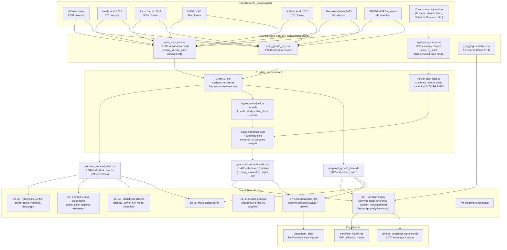
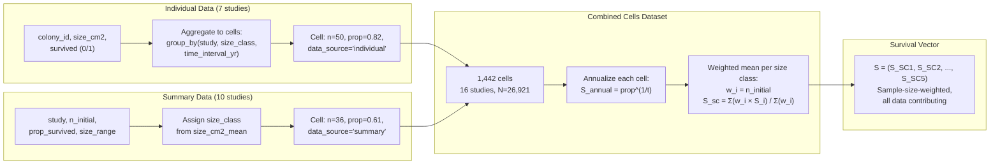

# Data Flow: Individual + Summary Survival Integration

How individual-level (0/1 per colony) and summary-level (proportion per cohort) survival data flow through the analysis pipeline.

## Full Pipeline

## Cell-Level Weighting Detail

## What Changed (2026-04-07)

| Before | After |
|--------|-------|
| `prepared_survival_data.rds` (individual 0/1) fed survival in scripts 13 & 17 | `prepared_survival_cells.rds` (cell-level, weighted) feeds survival in 13 & 17 |
| 7 studies, ~7,300 colonies in survival parameter estimation | 16 studies, ~26,900 colonies |
| Summary data orphaned (script 07 outputs read by no one) | Summary data integrated via cell stacking with sample-size weights |
| Bootstrap resampled individual colonies within studies | Bootstrap resamples cells within studies (same hierarchical structure, respects variable n) |
| `prepared_survival_data.rds` unchanged — still used by 40+ scripts for thresholds, GAMs, and figures | |

---

## Related Files

- [data_integration_issues.md](data_integration_issues.md) -- Individual + summary data combination method
- [extraction_protocol.md](extraction_protocol.md) -- Inclusion/exclusion criteria and size conversion rules
- [extraction_details.md](extraction_details.md) -- Per-study verification table with audit status
- [study_characteristics.md](study_characteristics.md) -- PRISMA-style study characteristics table
- [risk_of_bias.md](risk_of_bias.md) -- Newcastle-Ottawa bias assessment per study
- [disturbance_handling_decision.md](disturbance_handling_decision.md) -- Disturbance classification and inclusion rules
- [neely_2022_data_integration.md](neely_2022_data_integration.md) -- Neely et al. 2022 integration notes
