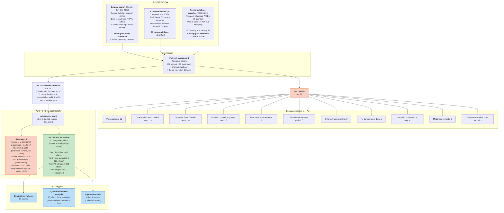

# PRISMA 2020 Flow Diagram

**Project:** Size-Dependent Demography of *Acropora palmata* -- Systematic Data Compilation
**Date:** March 2026
**Authors:** Raine Detmer, Adrian Stier

Numbers derived from `03_screening/full_text_screening.csv` (97 rows) and `01_protocol/systematic_review_protocol.md`.

---

## Counts at Each Stage

| Stage | n | Source |
|-------|---|--------|
| Studies evaluated in original search (Detmer 2025) | 52 (literature) + 3 (data repositories) = 55 | `full_text_screening.csv`: 54 rows from Detmer 2025 phase (includes 3 data repositories, 1 Gladfelter duplicate, and 3 Vardi entries for the same study; 52 unique literature studies after deduplication) |
| New candidates from expanded search (AI, March 2026) | 37 | `full_text_screening.csv`: 37 rows from AI expansion 2026 phase (33 unique new papers + 4 that were already variants of studies in the original 52) |
| PubMed formal search (2026-03-29) | 63 unique PMIDs | ~57 already in screening list; 6 new papers screened at full text |
| Web of Science formal search (2026-03-29) | 207--216 hits per query | Broader coverage than PubMed; saturation confirmed by Elicit (all 16 published included studies recovered) |
| New papers from formal database searches | 6 | All 6 EXCLUDED (see `screening_criteria.md` Section 8) |
| **Total unique studies assessed at full text** | **91** | 52 original + 33 expanded + 6 formal database = 91 unique papers (data repositories counted separately) |
| Included from original search | 17 | 14 from literature + 3 from data repositories (Rogers 1982 reclassified as included after re-evaluation) |
| Included from expanded search | 2 | 2 AI-extracted, passed independent audit |
| Included from formal database searches | 0 | Zero new includable studies identified |
| Total extracted for data | 22 | 17 + 5 = 22 (4 later removed) |
| Removed after independent audit or overlap audit | 4 | Ramos et al. 2024 (invalid survival proxy), Muller et al. 2008 (imprecise survival, no sizes, bleaching-confounded), Sutherland et al. 2016 (NOAA overlap + photostation design), Roth et al. 2013 (data overlap with Rogers & Muller 2012 -- same Haulover Bay colonies) |
| **Final included in meta-analysis** | **16 studies, 20 study-level effects** | k = 16 studies (20 effects; NOAA and Vardi each split by region) |
| Total excluded | 79 | In `full_text_screening.csv` (see reconciliation note below) |

---

## Exclusion Reasons Breakdown (n = 75)

Categorized from the `reason` and `notes` fields in `full_text_screening.csv`:

| Exclusion Reason | n | Examples |
|------------------|---|---------|
| Wrong species (not *A. palmata*) | 16 | *A. cervicornis* (6), *Orbicella faveolata* (3), *Diploria* spp. (3), *S. radians* (1), other (3) |
| Data overlap with included study | 13 | NOAA monitoring subset papers (Williams & Miller 2008/2012, Bright 2013, etc.), USGS overlap (Chapron 2023), model re-parameterization (Lirman 2003), Sutherland et al. 2016 (NOAA overlap + photostation design), Roth et al. 2013 (same Haulover Bay colonies as Rogers & Muller 2012), Manzello et al. 2025 (NOAA + CRF + Mote + USGS data), Muller et al. 2025 (review of programs already included) |
| Cross-sectional design / invalid survival proxy | 10 | Single time-point surveys, partial mortality prevalence (Ramos 2024, Gonzalez-Diaz 2019), repeated census without individual tracking, Birkart & Alvarez-Filip 2025 (drone aerial imagery), Cramer et al. 2020 (paleoecological synthesis), Banister et al. 2024 (BRT habitat model) |
| Linear or incompatible growth metric only | 7 | Branch linear extension only -- mm/yr not convertible to areal growth (Crabbe 2009/2010/2013, Gladfelter 1978, Bak 2009), branch-tip cm^2/day |
| Recruits, microfragments, or settlement only | 6 | Post-settlement recruits <1 cm^2 (Chamberland 2015, Schutter 2023, Papke 2021), hurricane fragment cementation (Fong & Lirman 1995, Williams 2008) |
| Observation period too short (<3 months) | 5 | Survival measured over hours--weeks (Erwin & Szmant 2010: 36 d; Olsen 2016: 48 h; Randall & Szmant 2009: 160 h; Ritson-Williams 2010: 6 wk; Miller 2014: 6--9 wk) |
| Did not meet other extraction criteria | 6 | Insufficient size data, survival not separable from treatment effects, ambiguous reporting, Muller et al. 2008 (imprecise survival, no sizes, bleaching-confounded) |
| No extractable demographic data | 5 | Spawning observations, tissue biomass physiology, quadrat-level disease prevalence, community-level data, Wilson & Edmunds 2026 (review/conceptual paper on rarity) |
| Reproduction/genetics only | 4 | Studies reporting only fecundity, spawning, or population genetics (Baums 2006, Irwin 2017, Japaud 2015, Porto-Hannes 2015) |
| Model-derived data (not primary observations) | 2 | Bayesian re-estimation from published parameters (Chen 2020), transition probabilities from Vardi 2011 model (Vardi et al. 2011 paper vs. dissertation) |
| Fragment survival only (non-annual) | 1 | Post-hurricane fragment fates over weeks--months, not annual whole-colony survival (Highsmith 1980) |
| **Total** | **75** | |

**Verification:** 18 INCLUDED + 79 EXCLUDED = 97 rows in screening CSV (excluding header). Of the 22 initially extracted, 4 were removed after independent audit or overlap audit (Ramos et al. 2024, Muller et al. 2008, Sutherland et al. 2016, Roth et al. 2013), yielding 16 final studies contributing 20 study-level effects (NOAA split into FL Keys/Curacao/Navassa = 3 effects; Vardi 2011 split into Jamaica/PR/Virgin Gorda = 3 effects). See the Reconciliation Note in the Arithmetic Verification section for how 97 CSV rows map to 91 unique papers + 75 unique excluded studies.

---

## ASCII Flow Diagram

```
 ╔═══════════════════════════════════════════════════════════════════════╗
 ║                        IDENTIFICATION                                ║
 ╚═══════════════════════════════════════════════════════════════════════╝

 ┌─────────────────────────────────────┐   ┌──────────────────────────────────┐
 │ Records from original search        │   │ Records from expanded search      │
 │ (Detmer, Jun--Dec 2025)             │   │ (AI-assisted, March 2026)         │
 │                                     │   │                                   │
 │ Google Scholar (5 search strings)   │   │ PDF library: 80 papers screened   │
 │ Data repositories: NOAA NCEI,       │   │ NotebookLM: 137 papers queried    │
 │   NOAA InPort, USGS CMGDS,         │   │ PubMed, Semantic Scholar           │
 │   USGS ScienceBase                  │   │                                   │
 │ Citation chaining                   │   │ New candidates identified:         │
 │ Direct data sharing (FUNDEMAR)      │   │   33 papers (not in original 52)  │
 │                                     │   │                                   │
 │ Unique studies evaluated: 52        │   │                                   │
 │ Data repositories identified: 3     │   │                                   │
 └──────────────────┬──────────────────┘   └────────────────┬─────────────────┘
                    │                                        │
 ┌──────────────────┴────────────────────────────────────────┤
 │                                                           │
 │  ┌──────────────────────────────────────────────────┐     │
 │  │ Formal database searches (2026-03-29)             │     │
 │  │                                                   │     │
 │  │ PubMed: 63 unique PMIDs (5 Boolean queries)       │     │
 │  │ Web of Science: 207--216 hits per query            │     │
 │  │                                                   │     │
 │  │ Cross-referenced against existing screening:       │     │
 │  │   ~57 PMIDs already in screening list             │     │
 │  │   6 new papers screened → all EXCLUDED             │     │
 │  │   0 new includable studies identified              │     │
 │  └──────────────────────────┬───────────────────────┘     │
 │                             │                             │
 └─────────────────────────────┴─────────────────────────────┘
                                       │
 ╔═════════════════════════════════════╧════════════════════════════════════╗
 ║                         FULL-TEXT SCREENING                              ║
 ╚═════════════════════════════════════╤════════════════════════════════════╝
                                       │
                    ┌──────────────────┴──────────────────┐
                    │                                     │
                    │ Studies assessed at full text:       │
                    │   91 unique papers                   │
                    │   (52 original + 33 expanded         │
                    │    + 6 formal database search)       │
                    │                                     │
                    │ Plus 3 data repository datasets      │
                    │   (screened separately)              │
                    │                                     │
                    └──────┬──────────────────────┬───────┘
                           │                      │
                    ┌──────┴──────┐         ┌─────┴───────────────────────────┐
                    │  EXCLUDED   │         │  INCLUDED for data extraction   │
                    │  n = 75     │         │  n = 16                         │
                    │             │         │                                  │
                    │  Reasons:   │         │  From original search:           │
                    │  (see below)│         │    14 literature studies          │
                    │             │         │     + 3 data repository datasets │
                    └──────┬──────┘         │    = 17 total                    │
                           │                │    (Rogers 1982 reclassified)    │
                           │                │                                  │
                           │                │  From expanded search:            │
                           │                │    5 extracted                    │
                           │                │    (3 later removed)             │
                           │                │    = 2 passing audit             │
                           │                └─────────────┬───────────────────┘
                           │                              │
     ┌─────────────────────┴──────────────┐               │
     │                                    │               │
     │ Wrong species ................. 16 │  ╔════════════╧══════════════════╗
     │ Data overlap .................. 13 │  ║      INDEPENDENT AUDIT        ║
     │ Cross-sectional / invalid ..... 10 │  ║  (AI-extracted studies only)   ║
     │ Linear/incompatible growth ..... 7 │  ╚════════════╤══════════════════╝
     │ Recruits/microfragments ........ 6 │               │
     │ Too short (<3 months) .......... 5 │        ┌──────┴──────────────────┐
     │ Other extraction criteria ...... 6 │        │                         │
     │ No demographic data ............ 5 │  ┌─────┴─────┐    ┌────────────┐
     │ Reproduction/genetics only ..... 4 │  │ REMOVED    │    │ PASSED     │
     │ Model-derived (not primary) .... 2 │  │ n = 4      │    │ n = 16     │
     │ Fragment survival (non-annual) . 1 │  │            │    │            │
     │                                    │  │ Ramos 2024 │    │ 6 Tier 1   │
     │ TOTAL ......................... 75 │  │ Muller 2008│    │ 7 Tier 2   │
     │                                    │  │ Sutherland │    │   (hand)   │
     └────────────────────────────────────┘  │  2016      │    │ 3 Tier 2   │
                                             │ Roth 2013  │    │   (AI)     │
                                             │            │    │            │
                                             │            │    │ = 16 unique│
                                             │            │    │   studies  │
                                             └────────────┘    │            │
                                                               │ 20 study-  │
                                                               │   level    │
                                                               │   effects  │
                                                               └────────────┘

 ╔════════════════════════════════════════════════════════════════════════╗
 ║  FINAL: 16 studies contributing 20 study-level survival effects        ║
 ║  (NOAA split by region: FL Keys/Curacao/Navassa = 3 effects;          ║
 ║   Vardi 2011 split by region: Jamaica/PR/Virgin Gorda = 3 effects)    ║
 ║                                                                       ║
 ║  Tier 1 (individual-level): 6 studies (7 effects), ~5,200 surv rec.   ║
 ║  Tier 2 (summary, hand):   7 studies (10 effects)                     ║
 ║  Tier 2 (summary, AI):     3 studies (3 effects)                      ║
 ║    (incl. Rogers 1982, reclassified from excluded after               ║
 ║     re-evaluation; Muller 2008, Sutherland 2016, & Roth 2013         ║
 ║     removed after audit)                                              ║
 ║                                                                       ║
 ║  Qualitative synthesis:    16 studies (all)                            ║
 ║  Quantitative synthesis:   20 effects (three-level RE meta, PLO)      ║
 ║  Population model:         6 Tier 1 studies (matrix parameterization) ║
 ╚════════════════════════════════════════════════════════════════════════╝
```

---

## Mermaid Flow Diagram



---

## Arithmetic Verification

The numbers in this flow diagram must satisfy these constraints:

| Check | Calculation | Result |
|-------|-------------|--------|
| Total CSV rows | 18 INCLUDED + 79 EXCLUDED | = 97 rows (matches CSV row count) |
| Original phase rows | 18 INCLUDED + 36 EXCLUDED | = 54 rows from Detmer 2025 phase |
| Expanded phase rows | 0 INCLUDED + 37 EXCLUDED | = 37 rows from AI expansion 2026 phase |
| Formal database search rows | 0 INCLUDED + 6 EXCLUDED | = 6 rows from PubMed formal 2026-03-29 phase |
| Studies to extraction | 17 original + 5 expanded + 0 formal | = 22 initially extracted |
| After audit | 22 extracted - 4 removed (Ramos 2024, Muller 2008, Sutherland 2016, Roth 2013) | = 18 entries in final data set (17 unique studies; Vardi = 3 regional entries) |
| In meta-analysis | 16 unique studies enter meta (Mendoza-Quiroz contributes individual-level data for GAMs only) | = 16 studies |
| Study-level effects | NOAA split into 3 regional effects + Vardi 3 regional effects + 14 other studies x1 each | = 20 effects |
| Exclusion reasons sum | 16 + 13 + 10 + 7 + 6 + 5 + 6 + 5 + 4 + 2 + 1 | = 75 unique excluded studies |

### Reconciliation: 97 CSV rows vs. 91 unique papers vs. 75 excluded studies

The screening CSV contains **97 data rows** (excluding header), but the flow diagram reports **91 unique papers assessed at full text**. The discrepancy arises from:

1. **3 data repository entries** (NOAA_survey, USGS_USVI, Fundemar) -- screened separately from literature publications
2. **1 duplicate row** (Gladfelter et al. 1978 appears twice, once under survival and once under growth)
3. **2 extra Vardi entries** (Vardi 2011, Vardi et al. 2011, and Vardi et al. 2012 are three CSV rows representing the same body of work; counted as 1 unique study)

Mapping: 97 rows - 3 data repos - 1 duplicate - 2 Vardi extras = **91 unique literature papers** (52 original + 33 expanded + 6 formal database search). Of these 91, plus 3 data repos = 94 unique screening assessments, of which 18 are INCLUDED and 79 are EXCLUDED (in the CSV). The flow diagram reports 75 unique excluded studies because 4 of the 79 EXCLUDED CSV rows are duplicates/variants of the same source (Gladfelter x1, Vardi x2, plus the AI expansion phase re-assessed 4 studies already in the original search phase).

**Note on formal database searches (2026-03-29):** PubMed (63 unique PMIDs across 5 Boolean queries) and Web of Science (207--216 hits per query) were searched to complete PRISMA-required database documentation. Approximately 57 of the 63 PubMed PMIDs were already present in the screening list. The 6 new papers were screened at full text and all excluded (Manzello 2025, Muller 2025, Birkart & Alvarez-Filip 2025, Wilson & Edmunds 2026, Cramer 2020, Banister 2024). Zero new includable studies were identified, validating the completeness of the original search strategy.

**Note on audit removals:** Four studies were initially extracted but later removed after independent audit or overlap audit: Ramos et al. 2024 (invalid survival proxy -- RM prevalence, not whole-colony death), Muller et al. 2008 (imprecise survival counts, no size data, bleaching-confounded), Sutherland et al. 2016 (NOAA spatial overlap at EDR site + photostation design not suitable for individual-level tracking), and Roth et al. 2013 (data overlap with Rogers & Muller 2012 -- same Haulover Bay colony data, confirmed from the paper's explicit citation and acknowledgments). Meanwhile, Rogers et al. 1982 was reclassified from "excluded -- fragment survival only" to "included" after re-evaluation showed it provides extractable annual survival data (173 labeled branches, 2 St. Croix sites, 11 months post-hurricane). In the screening CSV these four removed studies are coded as EXCLUDED, and Rogers 1982 is coded as INCLUDED.

**Note on NOAA split:** In the expanded meta-analysis, NOAA was split into 3 geographically independent regional effects (FL Keys, Curacao, Navassa) and modeled using a three-level random-effects structure (effects nested within studies). This increased the total from 18 effects (pre-split) to 20 effects from 16 unique studies.

---

## Data Sources

- **Screening decisions:** `03_screening/full_text_screening.csv`
- **Protocol with flow diagram context:** `01_protocol/systematic_review_protocol.md` Section 6
- **Study characteristics:** `04_extraction/study_characteristics.md`
- **Exclusion details:** `04_extraction/study_characteristics.md` Table 2
- **Audit documentation:** `04_extraction/extraction_details.md`

---

**Reference:** Page MJ, McKenzie JE, Bossuyt PM, et al. The PRISMA 2020 statement: an updated guideline for reporting systematic reviews. *BMJ*. 2021;372:n71. doi:10.1136/bmj.n71. Flow diagram template adapted from Figure 1 of the PRISMA 2020 statement.
