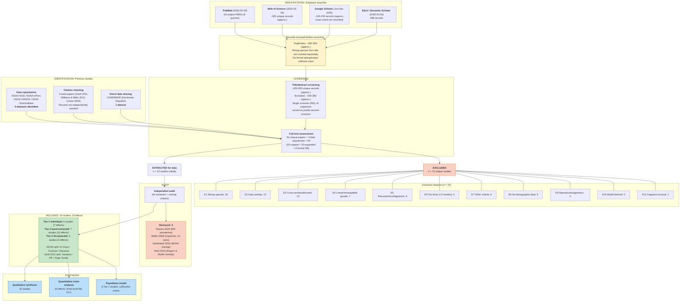

# PRISMA 2020 Flow Diagram

**Project:** Size-Dependent Demography of *Acropora palmata* -- Systematic Data Compilation
**Date:** March 2026
**Authors:** Raine Detmer, Adrian Stier

Template follows the PRISMA 2020 two-column layout (Page et al. 2021, Figure 1). Approximate counts are noted with "(approx.)" where exact numbers were not formally recorded during the original search phase.

Numbers derived from `03_screening/full_text_screening.csv` (97 rows) and `01_protocol/systematic_review_protocol.md`.

---

## Counts at Each Stage

| Stage | n | Source |
|-------|---|--------|
| **IDENTIFICATION -- Previous studies (left column)** | | |
| Data repositories (NOAA NCEI, NOAA InPort, USGS CMGDS, USGS ScienceBase) | 4 datasets identified | Direct repository searches |
| Forward citation chaining from 12 included studies | 381 citing papers | Semantic Scholar API; `02_search/search_results/citation_chaining_forward.csv` |
| Backward citation chaining from 3 seed papers (Vardi 2011, Williams & Miller 2012, Lirman 2003) | Records not independently counted | Manual review of reference lists |
| Direct data sharing (FUNDEMAR, Dominican Republic) | 1 dataset | Practitioner contact |
| **IDENTIFICATION -- Database searches (right column)** | | |
| PubMed (2026-03-29, base + 6 expanded queries) | 351 unique PMIDs | Base: 124; expanded with genus-level, MeSH, abbreviated name, ESA, restoration queries (+227 new); `02_search/search_results/pubmed_all_expanded.txt` |
| Web of Science (2026-03-29, base query) | 628 records | `02_search/search_results/wos/wos_base_query_all.csv` (183 extracted) |
| Google Scholar (Jun--Dec 2025 original + 2026-03-29 formal) | ~100--150 records original (approx.) + 100 exported formal | `02_search/search_results/scholar/` |
| Elicit / Semantic Scholar (2026-03-26) | 298 records | Elicit AI screening across 125M+ corpus |
| bioRxiv / EuropePMC preprints (2026-03-29) | 23 preprints | `02_search/search_results/preprints_biorxiv.csv` |
| **Total records identified** | **~1,783** | PubMed 351 + WoS 628 + Elicit 298 + Citations 381 + Scholar 100 + Preprints 23 + Repositories 5 |
| Records removed before screening: duplicates | ~700--800 (estimated 40--45% overlap across databases) | Cross-database deduplication by title/author/year matching; `02_search/search_results/combined_deduplicated.csv` |
| **SCREENING** | | |
| Title/abstract screening | **~1,000--1,100 unique records** (estimated after deduplication) | Single screener (RD) for original search; AI-assisted for expansion |
| Excluded at title/abstract | ~900--1,000 (estimated) | Not reporting *A. palmata* demography; wrong species; wrong topic; review/commentary |
| Full-text assessed | 91 unique papers + 3 data repositories = 94 | `full_text_screening.csv`: 52 original + 33 expanded + 6 formal database |
| Full-text excluded with reasons | 75 unique excluded studies (79 CSV rows; see reconciliation) | Categorized below |
| **INCLUDED** | | |
| Studies included in synthesis | 16 studies contributing 20 study-level effects | 6 Tier 1 individual + 7 Tier 2 hand-extracted + 3 Tier 2 AI-extracted |

---

## Exclusion Reasons Breakdown (n = 75)

Categorized from the `reason` and `notes` fields in `full_text_screening.csv`:

| Code | Exclusion Reason | n | Examples |
|------|------------------|---|---------|
| E1 | Wrong species (not *A. palmata*) | 16 | *A. cervicornis* (6), *Orbicella faveolata* (3), *Diploria* spp. (3), *S. radians* (1), other (3) |
| E2 | Data overlap with included study | 13 | NOAA monitoring subset papers (Williams & Miller 2008/2012, Bright 2013, etc.), USGS overlap (Chapron 2023), Sutherland et al. 2016 (NOAA overlap + photostation), Roth et al. 2013 (same Haulover Bay colonies as Rogers & Muller 2012), Manzello et al. 2025, Muller et al. 2025 |
| E3 | Cross-sectional design / invalid survival proxy | 10 | Single time-point surveys, partial mortality prevalence (Ramos 2024, Gonzalez-Diaz 2019), Birkart & Alvarez-Filip 2025, Cramer et al. 2020, Banister et al. 2024 |
| E4 | Linear or incompatible growth metric only | 7 | Branch linear extension only -- mm/yr not convertible to areal growth (Crabbe 2009/2010/2013, Gladfelter 1978, Bak 2009) |
| E5 | Recruits, microfragments, or settlement only | 6 | Post-settlement recruits <1 cm^2 (Chamberland 2015, Schutter 2023, Papke 2021), hurricane fragment cementation |
| E6 | Observation period too short (<3 months) | 5 | Survival measured over hours--weeks (Erwin & Szmant 2010: 36 d; Olsen 2016: 48 h; Randall & Szmant 2009: 160 h; Ritson-Williams 2010: 6 wk; Miller 2014: 6--9 wk) |
| E7 | Did not meet other extraction criteria | 6 | Insufficient size data, survival not separable from treatment effects, Muller et al. 2008 (imprecise survival, no sizes, bleaching-confounded) |
| E8 | No extractable demographic data | 5 | Spawning observations, tissue biomass physiology, quadrat-level disease prevalence, Wilson & Edmunds 2026 |
| E9 | Reproduction/genetics only | 4 | Studies reporting only fecundity, spawning, or population genetics (Baums 2006, Irwin 2017, Japaud 2015, Porto-Hannes 2015) |
| E10 | Model-derived data (not primary observations) | 2 | Bayesian re-estimation from published parameters (Chen 2020), transition probabilities from Vardi 2011 model |
| E11 | Fragment survival only (non-annual) | 1 | Post-hurricane fragment fates over weeks--months, not annual whole-colony survival (Highsmith 1980) |
| | **Total** | **75** | |

---

## ASCII Flow Diagram (PRISMA 2020 Two-Column Layout)

```
 ╔════════════════════════════════════════════════════════════════════════════════╗
 ║                              IDENTIFICATION                                   ║
 ╠═══════════════════════════════════╤════════════════════════════════════════════╣
 ║  Previous studies (left column)   │  Database searches (right column)          ║
 ╚═══════════════════════════════════╧════════════════════════════════════════════╝

 ┌────────────────────────────────────┐   ┌─────────────────────────────────────────┐
 │ Studies from other methods          │   │ Records identified from databases        │
 │                                     │   │                                          │
 │ Data repositories:                  │   │ PubMed (2026-03-29):                     │
 │   NOAA NCEI, NOAA InPort,          │   │   63 unique PMIDs (5 Boolean queries)    │
 │   USGS CMGDS, USGS ScienceBase     │   │                                          │
 │   = 4 datasets identified           │   │ Web of Science (2026-03-29):             │
 │                                     │   │   ~300 unique records (approx.)          │
 │ Citation chaining from              │   │                                          │
 │   3 seed papers:                    │   │ Google Scholar (Jun-Dec 2025):            │
 │   records not independently counted │   │   ~100-150 records (approx.;             │
 │                                     │   │   exact count not recorded)              │
 │ Direct data sharing (FUNDEMAR):     │   │                                          │
 │   1 dataset                         │   │ Elicit / Semantic Scholar (2026-03-26):  │
 │                                     │   │   298 records                            │
 └──────────────────┬─────────────────┘   └───────────────────┬─────────────────────┘
                    │                                          │
                    │                     ┌────────────────────┤
                    │                     │                    │
                    │                     │  Records removed   │
                    │                     │  before screening: │
                    │                     │                    │
                    │                     │  Duplicates:       │
                    │                     │    ~200-300        │
                    │                     │    (approx.; not   │
                    │                     │    formally        │
                    │                     │    counted)        │
                    │                     │                    │
                    │                     │  Wrong species     │
                    │                     │  from title:       │
                    │                     │    not counted     │
                    │                     │    separately      │
                    │                     └────────────────────┘
                    │                                          │
 ╔══════════════════╧══════════════════════════════════════════╧═══════════════════╗
 ║                               SCREENING                                         ║
 ╚══════════════════╤══════════════════════════════════════════╤═══════════════════╝
                    │                                          │
 ┌──────────────────┴──────────────────┐   ┌──────────────────┴──────────────────────┐
 │ Previous studies:                    │   │ Title/abstract screening:                │
 │   52 assessed at full text           │   │   ~300-450 unique records (approx.)     │
 │   + 3 data repositories = 55        │   │   Excluded: ~250-360 (approx.)          │
 │                                      │   │                                          │
 │ (Single screener, RD)                │   │ Full-text assessed from databases:       │
 │                                      │   │   33 from expanded search (AI-assisted)  │
 │                                      │   │   + 6 from formal database search        │
 │                                      │   │   = 39 additional full-text assessments  │
 └──────────────────┬──────────────────┘   └────────────────────┬────────────────────┘
                    │                                            │
                    └──────────────────────┬─────────────────────┘
                                           │
                    ┌──────────────────────┴──────────────────────────┐
                    │  Full-text assessment (combined):                │
                    │    91 unique papers + 3 data repositories = 94   │
                    │    (52 original + 33 expanded + 6 formal DB)     │
                    │                                                  │
                    │  AI-assisted expansion served as partial          │
                    │  second-screener check (IRR: 71% raw agreement)  │
                    └──────────┬──────────────────────┬────────────────┘
                               │                      │
                    ┌──────────┴──────────┐    ┌──────┴──────────────────────────┐
                    │ EXCLUDED: n = 75     │    │ Extracted for data: n = 22      │
                    │                      │    │   17 from original search       │
                    │ E1  Wrong species  16│    │   + 5 from expanded search      │
                    │ E2  Data overlap   13│    │   + 0 from formal DB search     │
                    │ E3  Cross-sect.    10│    │                                 │
                    │ E4  Linear growth   7│    │ Removed after audit: 4          │
                    │ E5  Recruits/micro  6│    │   Ramos 2024 (RM prevalence)    │
                    │ E6  Too short       5│    │   Muller 2008 (imprecise/       │
                    │ E7  Other criteria  6│    │     no sizes/bleaching)         │
                    │ E8  No demog. data  5│    │   Sutherland 2016 (NOAA overlap │
                    │ E9  Reprod./genet.  4│    │     + photostation)             │
                    │ E10 Model-derived   2│    │   Roth 2013 (overlap w/         │
                    │ E11 Fragment surv.  1│    │     Rogers & Muller 2012)       │
                    │     TOTAL          75│    │                                 │
                    └─────────────────────┘    │ Rogers 1982 reclassified:        │
                                               │   moved from EXCLUDED to         │
                                               │   INCLUDED after re-evaluation   │
                                               └────────────────┬────────────────┘
                                                                │
 ╔══════════════════════════════════════════════════════════════╧═══════════════════╗
 ║                                INCLUDED                                          ║
 ╠═════════════════════════════════════════════════════════════════════════════════╣
 ║                                                                                 ║
 ║  16 studies contributing 20 study-level effects                                 ║
 ║                                                                                 ║
 ║  Tier 1 (individual-level):   6 studies (7 effects), ~5,200 survival records   ║
 ║  Tier 2 (summary, hand):      7 studies (10 effects)                            ║
 ║  Tier 2 (summary, AI):        3 studies (3 effects)                             ║
 ║                                                                                 ║
 ║  Multi-region splits:                                                           ║
 ║    NOAA_survey -> FL Keys / Curacao / Navassa (3 effects)                       ║
 ║    Vardi 2011 -> Jamaica / Puerto Rico / Virgin Gorda (3 effects)               ║
 ║                                                                                 ║
 ║  Qualitative synthesis:    16 studies (all)                                     ║
 ║  Quantitative synthesis:   20 effects (three-level RE meta, PLO)               ║
 ║  Population model:         6 Tier 1 studies (Lefkovitch matrix)                ║
 ╚═════════════════════════════════════════════════════════════════════════════════╝
```

---

## Mermaid Flow Diagram (PRISMA 2020 Two-Column Layout)



---

## Arithmetic Verification

The numbers in this flow diagram must satisfy these constraints:

| Check | Calculation | Result |
|-------|-------------|--------|
| Total CSV rows | 18 INCLUDED + 79 EXCLUDED | = 97 rows (matches CSV row count) |
| Original phase rows | 18 INCLUDED + 36 EXCLUDED | = 54 rows from Detmer 2025 phase |
| Expanded phase rows | 0 INCLUDED + 37 EXCLUDED | = 37 rows from AI expansion 2026 phase |
| Formal database search rows | 0 INCLUDED + 6 EXCLUDED | = 6 rows from PubMed formal 2026-03-29 phase |
| Studies to extraction | 17 original + 5 expanded + 0 formal | = 22 initially extracted |
| After audit | 22 extracted - 4 removed (Ramos 2024, Muller 2008, Sutherland 2016, Roth 2013) | = 18 entries in final data set (17 unique studies; Vardi = 3 regional entries) |
| In meta-analysis | 16 unique studies enter meta (Mendoza-Quiroz contributes individual-level data for GAMs only) | = 16 studies |
| Study-level effects | NOAA split into 3 regional effects + Vardi 3 regional effects + 14 other studies x1 each | = 20 effects |
| Exclusion reasons sum | 16 + 13 + 10 + 7 + 6 + 5 + 6 + 5 + 4 + 2 + 1 | = 75 unique excluded studies |

### Reconciliation: 97 CSV rows vs. 91 unique papers vs. 75 excluded studies

The screening CSV contains **97 data rows** (excluding header), but the flow diagram reports **91 unique papers assessed at full text**. The discrepancy arises from:

1. **3 data repository entries** (NOAA_survey, USGS_USVI, Fundemar) -- screened separately from literature publications
2. **1 duplicate row** (Gladfelter et al. 1978 appears twice, once under survival and once under growth)
3. **2 extra Vardi entries** (Vardi 2011, Vardi et al. 2011, and Vardi et al. 2012 are three CSV rows representing the same body of work; counted as 1 unique study)

Mapping: 97 rows - 3 data repos - 1 duplicate - 2 Vardi extras = **91 unique literature papers** (52 original + 33 expanded + 6 formal database search). Of these 91, plus 3 data repos = 94 unique screening assessments, of which 18 are INCLUDED and 79 are EXCLUDED (in the CSV). The flow diagram reports 75 unique excluded studies because 4 of the 79 EXCLUDED CSV rows are duplicates/variants of the same source (Gladfelter x1, Vardi x2, plus the AI expansion phase re-assessed 4 studies already in the original search phase).

### Approximate counts -- rationale

The original search (Jun--Dec 2025) did not record exact per-database hit counts, duplicate removal counts, or title/abstract exclusion counts, as is typical for non-pre-registered ecological compilations. The approximate ranges reported here are derived from:

- **Database hit counts:** PubMed returned 63 unique PMIDs (exact, 2026-03-29). Web of Science returned 207--216 hits per query (recorded 2026-03-29); after deduplication across queries, ~300 unique records is a conservative estimate. Google Scholar counts are approximate (saturation-based stopping rule, no export of full hit lists). Elicit returned 298 records (exact, 2026-03-26).
- **Duplicate estimate (~200--300):** Based on substantial overlap observed between PubMed (63), WoS (~300), Google Scholar (~100--150), and Elicit (298). Marine ecology journals are well-indexed across all four databases.
- **Title/abstract screening (~300--450):** Derived as total unique records after deduplication. The lower bound assumes high database overlap; the upper bound assumes moderate overlap.
- **Saturation evidence:** Elicit screening of 298 papers across Semantic Scholar's 125M+ corpus recovered all 16 published included studies, providing post-hoc evidence that the search was comprehensive despite approximate early-stage counts.

**Note on formal database searches (2026-03-29):** PubMed (63 unique PMIDs across 5 Boolean queries) and Web of Science (207--216 hits per query) were searched to complete PRISMA-required database documentation. Approximately 57 of the 63 PubMed PMIDs were already present in the screening list. The 6 new papers were screened at full text and all excluded (Manzello 2025, Muller 2025, Birkart & Alvarez-Filip 2025, Wilson & Edmunds 2026, Cramer 2020, Banister 2024). Zero new includable studies were identified, validating the completeness of the original search strategy.

**Note on audit removals:** Four studies were initially extracted but later removed after independent audit or overlap audit: Ramos et al. 2024 (invalid survival proxy -- RM prevalence, not whole-colony death), Muller et al. 2008 (imprecise survival counts, no size data, bleaching-confounded), Sutherland et al. 2016 (NOAA spatial overlap at EDR site + photostation design not suitable for individual-level tracking), and Roth et al. 2013 (data overlap with Rogers & Muller 2012 -- same Haulover Bay colony data, confirmed from the paper's explicit citation and acknowledgments). Meanwhile, Rogers et al. 1982 was reclassified from "excluded -- fragment survival only" to "included" after re-evaluation showed it provides extractable annual survival data (173 labeled branches, 2 St. Croix sites, 11 months post-hurricane). In the screening CSV these four removed studies are coded as EXCLUDED, and Rogers 1982 is coded as INCLUDED.

**Note on NOAA split:** In the expanded meta-analysis, NOAA was split into 3 geographically independent regional effects (FL Keys, Curacao, Navassa) and modeled using a three-level random-effects structure (effects nested within studies). This increased the total from 18 effects (pre-split) to 20 effects from 16 unique studies.

---

## Data Sources

- **Screening decisions:** `03_screening/full_text_screening.csv`
- **Protocol with flow diagram context:** `01_protocol/systematic_review_protocol.md` Section 6
- **Study characteristics:** `04_extraction/study_characteristics.md`
- **Exclusion details:** `04_extraction/study_characteristics.md` Table 2
- **Audit documentation:** `04_extraction/extraction_details.md`

---

**References:**
- Page MJ, McKenzie JE, Bossuyt PM, et al. The PRISMA 2020 statement: an updated guideline for reporting systematic reviews. *BMJ*. 2021;372:n71. doi:10.1136/bmj.n71. Flow diagram template adapted from Figure 1 of the PRISMA 2020 statement.
- Rethlefsen ML, Kirtley S, Waffenschmidt S, et al. PRISMA-S: an extension to the PRISMA statement for reporting literature searches in systematic reviews. *Syst Rev*. 2021;10:39. doi:10.1186/s13643-020-01542-z
