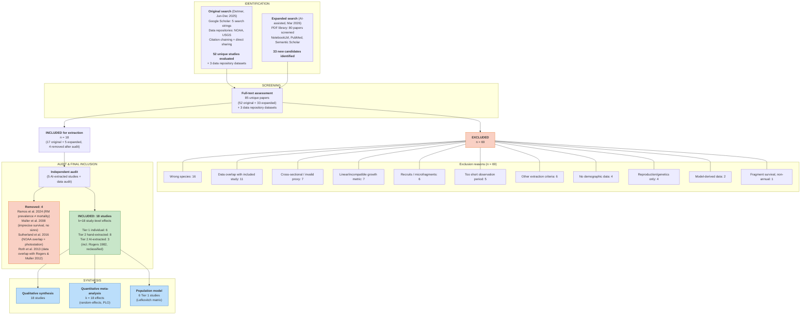

# PRISMA 2020 Flow Diagram

**Project:** Size-Dependent Demography of *Acropora palmata* -- Systematic Data Compilation
**Date:** March 2026
**Authors:** Raine Detmer, Adrian Stier

Numbers derived from `03_screening/full_text_screening.csv` (87 entries) and `01_protocol/systematic_review_protocol.md`.

---

## Counts at Each Stage

| Stage | n | Source |
|-------|---|--------|
| Studies evaluated in original search (Detmer 2025) | 52 (literature) + 3 (data repositories) = 55 | `full_text_screening.csv`: 51 literature full-text + 3 data repository entries from Detmer 2025 phase (note: 2 screened entries for the same study are counted once) |
| New candidates from expanded search (AI, March 2026) | 33 | `full_text_screening.csv`: 33 entries from AI expansion 2026 phase |
| **Total unique studies assessed at full text** | **85** | 52 literature studies + 33 expanded = 85 unique papers (data repositories counted separately) |
| Included from original search | 17 | 14 from literature + 3 from data repositories (Rogers 1982 reclassified as included after re-evaluation) |
| Included from expanded search | 2 | 2 AI-extracted, passed independent audit |
| Total extracted for data | 22 | 17 + 5 = 22 (4 later removed) |
| Removed after independent audit or overlap audit | 4 | Ramos et al. 2024 (invalid survival proxy), Muller et al. 2008 (imprecise survival, no sizes, bleaching-confounded), Sutherland et al. 2016 (NOAA overlap + photostation design), Roth et al. 2013 (data overlap with Rogers & Muller 2012 -- same Haulover Bay colonies) |
| **Final included in meta-analysis** | **18 studies, 18 study-level effects** | k = 18 |
| Total excluded | 69 | 37 from original + 32 from expanded (Roth moved from included to excluded) |

---

## Exclusion Reasons Breakdown (n = 69)

Categorized from the `reason` and `notes` fields in `full_text_screening.csv`:

| Exclusion Reason | n | Examples |
|------------------|---|---------|
| Wrong species (not *A. palmata*) | 16 | *A. cervicornis* (6), *Orbicella faveolata* (3), *Diploria* spp. (3), *S. radians* (1), other (3) |
| Data overlap with included study | 11 | NOAA monitoring subset papers (Williams & Miller 2008/2012, Bright 2013, etc.), USGS overlap (Chapron 2023), model re-parameterization (Lirman 2003), Sutherland et al. 2016 (NOAA overlap + photostation design), Roth et al. 2013 (same Haulover Bay colonies as Rogers & Muller 2012) |
| Cross-sectional design / invalid survival proxy | 7 | Single time-point surveys, partial mortality prevalence (Ramos 2024, Gonzalez-Diaz 2019), repeated census without individual tracking |
| Linear or incompatible growth metric only | 7 | Branch linear extension only -- mm/yr not convertible to areal growth (Crabbe 2009/2010/2013, Gladfelter 1978, Bak 2009), branch-tip cm^2/day |
| Recruits, microfragments, or settlement only | 6 | Post-settlement recruits <1 cm^2 (Chamberland 2015, Schutter 2023, Papke 2021), hurricane fragment cementation (Fong & Lirman 1995, Williams 2008) |
| Observation period too short (<3 months) | 5 | Survival measured over hours--weeks (Erwin & Szmant 2010: 36 d; Olsen 2016: 48 h; Randall & Szmant 2009: 160 h; Ritson-Williams 2010: 6 wk; Miller 2014: 6--9 wk) |
| Did not meet other extraction criteria | 6 | Insufficient size data, survival not separable from treatment effects, ambiguous reporting, Muller et al. 2008 (imprecise survival, no sizes, bleaching-confounded) |
| No extractable demographic data | 4 | Spawning observations, tissue biomass physiology, quadrat-level disease prevalence, community-level data |
| Reproduction/genetics only | 4 | Studies reporting only fecundity, spawning, or population genetics (Baums 2006, Irwin 2017, Japaud 2015, Porto-Hannes 2015) |
| Model-derived data (not primary observations) | 2 | Bayesian re-estimation from published parameters (Chen 2020), transition probabilities from Vardi 2011 model (Vardi et al. 2011 paper vs. dissertation) |
| Fragment survival only (non-annual) | 1 | Post-hurricane fragment fates over weeks--months, not annual whole-colony survival (Highsmith 1980) |
| **Total** | **69** | |

**Verification:** 18 included + 69 excluded = 87 = total rows in screening CSV (excluding header). Of the 22 initially extracted, 4 were removed after independent audit or overlap audit (Ramos et al. 2024, Muller et al. 2008, Sutherland et al. 2016, Roth et al. 2013), yielding 18 final studies with 18 study-level effects.

---

## ASCII Flow Diagram

```
 ╔═══════════════════════════════════════════════════════════════════════╗
 ║                        IDENTIFICATION                                ║
 ╚═══════════════════════════════════════════════════════════════════════╝

 ┌─────────────────────────────────────┐   ┌──────────────────────────────────┐
 │ Records from original search        │   │ Records from expanded search      │
 │ (Detmer, Jun--Dec 2025)             │   │ (AI-assisted, March 2026)         │
 │                                     │   │                                   │
 │ Google Scholar (5 search strings)   │   │ PDF library: 80 papers screened   │
 │ Data repositories: NOAA NCEI,       │   │ NotebookLM: 137 papers queried    │
 │   NOAA InPort, USGS CMGDS,         │   │ PubMed, Semantic Scholar           │
 │   USGS ScienceBase                  │   │                                   │
 │ Citation chaining                   │   │ New candidates identified:         │
 │ Direct data sharing (FUNDEMAR)      │   │   33 papers (not in original 52)  │
 │                                     │   │                                   │
 │ Unique studies evaluated: 52        │   │                                   │
 │ Data repositories identified: 3     │   │                                   │
 └──────────────────┬──────────────────┘   └────────────────┬─────────────────┘
                    │                                        │
                    └──────────────────┬─────────────────────┘
                                       │
 ╔═════════════════════════════════════╧════════════════════════════════════╗
 ║                         FULL-TEXT SCREENING                              ║
 ╚═════════════════════════════════════╤════════════════════════════════════╝
                                       │
                    ┌──────────────────┴──────────────────┐
                    │                                     │
                    │ Studies assessed at full text:       │
                    │   85 unique papers                   │
                    │   (52 original + 33 expanded)        │
                    │                                     │
                    │ Plus 3 data repository datasets      │
                    │   (screened separately)              │
                    │                                     │
                    └──────┬──────────────────────┬───────┘
                           │                      │
                    ┌──────┴──────┐         ┌─────┴───────────────────────────┐
                    │  EXCLUDED   │         │  INCLUDED for data extraction   │
                    │  n = 69     │         │  n = 18                         │
                    │             │         │                                  │
                    │  Reasons:   │         │  From original search:           │
                    │  (see below)│         │    14 literature studies          │
                    │             │         │     + 3 data repository datasets │
                    └──────┬──────┘         │    = 17 total                    │
                           │                │    (Rogers 1982 reclassified)    │
                           │                │                                  │
                           │                │  From expanded search:            │
                           │                │    5 extracted                    │
                           │                │    (3 later removed)             │
                           │                │    = 2 passing audit             │
                           │                └─────────────┬───────────────────┘
                           │                              │
     ┌─────────────────────┴──────────────┐               │
     │                                    │               │
     │ Wrong species ................. 16 │  ╔════════════╧══════════════════╗
     │ Data overlap .................. 11 │  ║      INDEPENDENT AUDIT        ║
     │ Cross-sectional / invalid ...... 7 │  ║  (AI-extracted studies only)   ║
     │ Linear/incompatible growth ..... 7 │  ╚════════════╤══════════════════╝
     │ Recruits/microfragments ........ 6 │               │
     │ Too short (<3 months) .......... 5 │        ┌──────┴──────────────────┐
     │ Other extraction criteria ...... 6 │        │                         │
     │ No demographic data ............ 4 │  ┌─────┴─────┐    ┌────────────┐
     │ Reproduction/genetics only ..... 4 │  │ REMOVED    │    │ PASSED     │
     │ Model-derived (not primary) .... 2 │  │ n = 4      │    │ n = 18     │
     │ Fragment survival (non-annual) . 1 │  │            │    │            │
     │                                    │  │ Ramos 2024 │    │ 6 Tier 1   │
     │ TOTAL ......................... 69 │  │ Muller 2008│    │ 8 Tier 2   │
     │                                    │  │ Sutherland │    │   (hand)   │
     └────────────────────────────────────┘  │  2016      │    │ 3 Tier 2   │
                                             │ Roth 2013  │    │   (AI)     │
                                             │            │    │            │
                                             │            │    │ = 18 unique│
                                             │            │    │   studies  │
                                             └────────────┘    │            │
                                                               │ k=18 study │
                                                               │   -level   │
                                                               │   effects  │
                                                               └────────────┘

 ╔════════════════════════════════════════════════════════════════════════╗
 ║  FINAL: 18 studies contributing k=18 study-level survival effects     ║
 ║                                                                       ║
 ║  Tier 1 (individual-level): 6 studies, ~5,200 survival records        ║
 ║  Tier 2 (summary, hand):   8 studies                                  ║
 ║  Tier 2 (summary, AI):     3 studies                                  ║
 ║    (incl. Rogers 1982, reclassified from excluded after               ║
 ║     re-evaluation; Muller 2008, Sutherland 2016, & Roth 2013         ║
 ║     removed after audit)                                              ║
 ║                                                                       ║
 ║  Qualitative synthesis:    18 studies (all)                            ║
 ║  Quantitative synthesis:   k=18 (random-effects meta, PLO)            ║
 ║  Population model:         6 Tier 1 studies (matrix parameterization) ║
 ╚════════════════════════════════════════════════════════════════════════╝
```

---

## Mermaid Flow Diagram



---

## Arithmetic Verification

The numbers in this flow diagram must satisfy these constraints:

| Check | Calculation | Result |
|-------|-------------|--------|
| Total screened entries | 18 included + 69 excluded | = 87 (matches CSV row count) |
| Original phase | 16 included + 38 excluded | = 54 (matches Detmer 2025 count; Rogers 1982 reclassified from excluded to included; Roth 2013 moved to excluded) |
| Expanded phase | 2 included + 31 excluded | = 33 (matches AI expansion count; Muller 2008 & Sutherland 2016 moved to excluded) |
| Studies to extraction | 17 original + 5 expanded | = 22 initially extracted |
| After audit | 22 extracted - 4 removed (Ramos 2024, Muller 2008, Sutherland 2016, Roth 2013) | = 18 studies in final set |
| Study-level effects | 18 studies | = k=18 effects |
| Exclusion reasons sum | 16 + 11 + 7 + 7 + 6 + 5 + 6 + 4 + 4 + 2 + 1 | = 69 |

**Note on audit removals:** Four studies were initially extracted but later removed after independent audit or overlap audit: Ramos et al. 2024 (invalid survival proxy -- RM prevalence, not whole-colony death), Muller et al. 2008 (imprecise survival counts, no size data, bleaching-confounded), Sutherland et al. 2016 (NOAA spatial overlap at EDR site + photostation design not suitable for individual-level tracking), and Roth et al. 2013 (data overlap with Rogers & Muller 2012 -- same Haulover Bay colony data, confirmed from the paper's explicit citation and acknowledgments). Meanwhile, Rogers et al. 1982 was reclassified from "excluded -- fragment survival only" to "included" after re-evaluation showed it provides extractable annual survival data (173 labeled branches, 2 St. Croix sites, 11 months post-hurricane). In the screening CSV these four removed studies are coded as EXCLUDED, and Rogers 1982 is coded as INCLUDED. The final arithmetic (18 included + 69 excluded = 87) holds.

---

## Data Sources

- **Screening decisions:** `03_screening/full_text_screening.csv`
- **Protocol with flow diagram context:** `01_protocol/systematic_review_protocol.md` Section 6
- **Study characteristics:** `04_extraction/study_characteristics.md`
- **Exclusion details:** `04_extraction/study_characteristics.md` Table 2
- **Audit documentation:** `04_extraction/extraction_details.md`

---

**Reference:** Page MJ, McKenzie JE, Bossuyt PM, et al. The PRISMA 2020 statement: an updated guideline for reporting systematic reviews. *BMJ*. 2021;372:n71. doi:10.1136/bmj.n71. Flow diagram template adapted from Figure 1 of the PRISMA 2020 statement.
