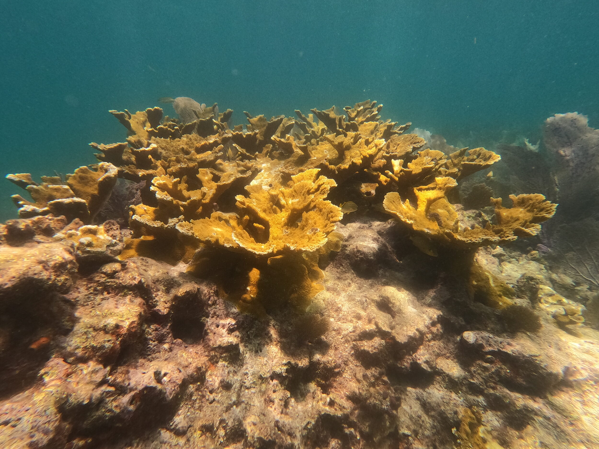

<p align="center">
  
</p>

<h1 align="center"><i>Acropora palmata</i> demography</h1>

<p align="center">
  A reproducible Caribbean-wide synthesis of elkhorn coral survival, growth, disturbance, and conditional transition dynamics.
</p>

<p align="center">
  <a href="https://www.r-project.org/"></a>
  
  <a href="06_analysis/scripts/run_all.R"></a>
</p>

> **The question:** How do *A. palmata* survival and growth vary with colony size across the Caribbean, and what does that mean for persistence and restoration under chronic disturbance?

This repository updates the Vardi et al. (2012) Lefkovitch projection model using 14,160 individual-level observations from seven studies and summary-level data from 10 additional studies. It estimates size-dependent vital rates across 13 Caribbean regions, carries uncertainty through hierarchical bootstrap and meta-analysis, and produces the parameter distributions used by the companion Restoration Strategy Evaluation model.

| What this repository provides | Where to start |
| --- | --- |
| Canonical demographic data, reproducible R analyses, manuscript figures, and RSE-ready parameter lists | [Analysis workflow](06_analysis/README.md) · [Manuscript-facing outputs](07_reporting/README.md) · [Quick start](#quick-start) |

**Current analysis status.** The interval-annualized meta-analysis estimates pooled annual survival at 78.7% (95% CI: 70.4–85.1%; 95% prediction interval: 37.4–95.8%; 17 studies, 22 effects). The recruitment-free post-settlement transition subsystem has deterministic λ = 0.961 (bootstrap interval: 0.816–1.010). This is not a forecast of whole-population viability because sexual recruitment and external recruitment are fixed at zero. A clean-clone rerun under the locked R environment remains a release requirement.

**Design principle.** Transparency over false precision: analyses distinguish manuscript-facing results from supporting and exploratory work, expose heterogeneity, and preserve a traceable path from source studies to model parameters.

**Companion project.** [Detmer-2025-coral-RSE](https://github.com/stier-lab/Detmer-2025-coral-RSE) uses these parameter distributions in a restoration decision-support model and interactive app. Clone both repositories alongside one another so its R analyses can resolve `../Detmer-2025-coral-parameters/`.

---

## Parent Goal and Paper Goals

### Parent Goal

Build a Caribbean-wide, size-structured understanding of *Acropora palmata* demography that is good enough to support defensible inference about conditional transition dynamics, disturbance exposure, and restoration decision-making.

### Paper Goals

1. Quantify how demographic rates vary across colony size, including survival, growth, shrinkage, and fragmentation.
2. Test whether those size relationships are nonlinear, with thresholds or inflection points rather than simple linear scaling.
3. Translate size-structured demographic rates into conditional post-settlement transition dynamics, especially the size classes and transitions that drive `λ` in the recruitment-free subsystem.
4. Treat disturbance as part of the demographic regime facing *A. palmata*, including hurricanes, disease, heatwaves, cold events, predators, and chronic stressors.
5. Map disturbance through Caribbean time and space, then connect disturbance windows to observed demographic performance.
6. Compare natural-colony and restoration-fragment demography, including when differences persist after accounting for size.
7. Evaluate what the synthesis implies for restoration: target sizes, habitats, regions, and disturbance windows that are more or less favorable for persistence.
8. Quantify heterogeneity and transferability across studies, regions, and years so pooled estimates are interpreted with appropriate caution.
9. Make uncertainty and data gaps explicit, especially for recruitment, fecundity, chronic stress, and large-adult dynamics outside Florida.

For a more detailed goal-to-analysis roadmap, see [the paper roadmap](07_reporting/internal/paper_scope_and_analysis_roadmap.md).

---

## Systematic Review Structure

This repository follows a **PRISMA-first layout** where top-level directories map to the stages of a systematic review and meta-analysis:

| Directory | PRISMA Stage | Contents |
|-----------|-------------|----------|
| `01_protocol/` | Registration | Pre-analysis plan, systematic review protocol |
| `02_search/` | Identification | Search strings, Elicit/Google Scholar exports |
| `03_screening/` | Screening | Full-text screening decisions (104 data rows, 101 unique assessments), IRR assessment |
| `04_extraction/` | Data extraction | Extraction protocol, study characteristics, risk of bias, original researcher notes |
| `05_data/` | Data | Original (14 raw files), standardized (analysis-ready CSVs), integration artifacts, and expanded search data |
| `06_analysis/` | Analysis | 69 top-level R scripts, generated outputs, figures, and directory indexes |
| `07_reporting/` | Reporting | Manuscript methods + narrative drafts, figure legends, build maps, crosswalks, advanced-model reports, and support tables |

This organization ensures every step from literature search to final analysis is traceable and reproducible, consistent with PRISMA 2020 guidelines. For data-surface navigation, start with [05_data/README.md](05_data/README.md).

---

## Key Results

| Finding | Value | Interpretation |
|---------|-------|----------------|
| **Conditional transition λ** | 0.961 (CI: 0.816–1.010) | Recruitment-free post-settlement subsystem; 94.3% of bootstrap replicates had λ < 1, not a real-world decline probability |
| **Most Critical Parameter** | SC5 Stasis | Large-adult persistence contributes 58.9% of matrix-cell elasticity |
| **Survival Nonlinearity** | Threshold ~7,498 cm² | Supported sigmoidal survival response, but weakly stable across study folds |
| **Core Growth Nonlinearity** | RGR threshold at 36.9 cm² | The steepest proportional-growth shift occurs early in ontogeny |
| **Shrinkage Frequency** | 39.4% | Matrix-compatible growth records frequently show tissue loss rather than simple positive growth |
| **Disturbance × Size** | Survival interaction `p = 6.93e-4` | Size–survival associations differed among curated exposure categories; this observational comparison does not estimate a causal disturbance effect |
| **Study Heterogeneity (I²)** | 97.6% | Between-study variation is substantial; the prediction interval is 37.4–95.8% |
| **Expanded Meta-Analysis** | 78.7% (k=17; 22 effects) | Tier-1 and Tier-2 inputs use the same interval-annualized time scale |
| **Natural vs Restoration** | 85.4% vs 74.5% | 10.9 pp difference, p=0.199; the comparison is underpowered and not statistically supported |
| **Updates Vardi (2012)** | Lefkovitch matrix | Largest dataset for species |
| **Pre-2023 baseline** | All vital rates pre-date the 2023 Florida heatwave | Manzello et al. (2025, *Science*) documented functional extinction of *A. palmata* from Florida at 16-20 DHW. This matrix describes the chronic regime before that event. |
| **Recruitment assumption** | λ = 0.961 assumes no sexual or external recruitment | Fragmentation is the only recruitment pathway represented; λ is therefore conditional rather than a full population forecast. |
| **Biological-realism framework (FigS29)** | 9-scenario sensitivity analysis | Layered seven literature-sourced mechanisms (Vardi 2011 size threshold; Mendoza-Quiroz 2023 oocyte density; Lirman 2000a sterility lag; Piñón-González 2018 lesion penalty; Boisvert 2024 outplant decay; Rodriguez-Martinez 2014 winter SST; Williams 2012 depensatory corallivory; depth refugia). Biggest driver: outplant-age penalty Δλ = −0.126; depth refugia +0.064; "all combined" Δλ = +0.094. |

> For manuscript-facing interpretation, use [the manuscript draft](07_reporting/manuscript/acropora_palmata_demography_manuscript_draft.md), [the claim-to-output crosswalk](07_reporting/internal/claim_output_crosswalk.md), and [the figure/table map](07_reporting/manuscript/figure_table_map.md).

---

## Repository Structure

```
Detmer-2025-coral-parameters/
├── 01_protocol/                    # PRISMA registration & pre-analysis plan
│   ├── systematic_review_protocol.md
│   └── PRISMA_TODO_resolution.md
├── 02_search/                      # Identification phase
│   ├── search_strings.md
│   ├── search_summary.md
│   └── search_results/             # Elicit + Google Scholar exports
├── 03_screening/                   # Screening phase
│   └── full_text_screening.csv       # 104 data rows (101 unique assessments)
├── 04_extraction/                  # Data extraction phase
│   ├── extraction_protocol.md        # Inclusion/exclusion, overlap rules, audit log
│   ├── study_characteristics.md
│   ├── extraction_details.md
│   ├── risk_of_bias.md
│   ├── data_integration_issues.md    # Individual vs summary data integration
│   ├── data_flow_diagram.md          # Mermaid pipeline diagram
│   └── raine_working_notes/          # Original researcher's Excel trackers + notes
├── 05_data/                        # All data
│   ├── original/                     # 14 raw source files (DO NOT MODIFY)
│   ├── standardized/                 # Cleaned analysis-ready CSVs
│   ├── expanded_search/              # Expanded search data
│   └── integration/                  # APAL_data_integration.rmd
├── 06_analysis/                    # Statistical analysis
│   ├── scripts/                      # 69 top-level R scripts + utils/
│   │   ├── 00_standardize_*.R         # Site-specific standardization helpers
│   │   ├── 01_data_preparation.R
│   │   ├── 02-07_*.R                   # Core analysis
│   │   ├── 08-12_*.R                   # Robustness & evaluation
│   │   ├── 13-17_*.R, 14b_*.R          # Synthesis (matrix, meta-analysis k=17/22 effects)
│   │   ├── 18-22_*.R, 20b/c_*.R        # Manuscript figures (Fig 1-4)
│   │   ├── 23-28_*.R                   # Core supplementary figures S2-S14 (later extensions add S15-S30)
│   │   ├── 29-40_*.R, 31b, 49_*.R      # Context, disturbance, completeness, temporal scenarios
│   │   ├── 41-47_*.R                   # Advanced dynamic model extensions
│   │   ├── 48_pipeline_refresh_audit.R # Pipeline manifest refresh
│   │   ├── 50-61_*.R                   # Biological realism scenario framework + FigS29
│   │   ├── run_all.R                   # Pipeline orchestrator
│   │   └── utils/                      # Shared utilities (theme, palette, constants, matrix helpers)
│   ├── output/                       # ~320 CSV + ~18 RDS result files
│   └── figures/                      # Publication figures (generated)
│       ├── manuscript/                 # Fig1-Fig4 (PDF + PNG)
│       └── supplementary/              # FigS1-FigS29, exploratory/, diagnostics/, meta_analysis/
├── 07_reporting/                   # Manuscript outputs
│   ├── README.md
│   ├── manuscript/                   # Submission-ready content
│   │   ├── manuscript_methods_draft.md
│   │   ├── manuscript_narrative_integration.md
│   │   ├── figure_legends.txt
│   │   ├── figure_table_map.md
│   │   ├── prisma_flow_diagram.md
│   │   ├── conceptual_summary.svg
│   │   └── tables/
│   └── internal/                     # Process docs, audits, working notes
│       ├── claim_output_crosswalk.md
│       ├── paper_scope_and_analysis_roadmap.md
│       ├── advanced_models/
│       └── generated/
├── literature/                     # 145 PDFs organized by role
│   └── pdfs/{data_studies,context,methods,restoration,preprints}/
├── parameter_lists/                # 7 RDS model parameter outputs
├── CLAUDE.md
└── README.md
```

---

## Quick Start

### Prerequisites

- **R** (≥ 4.3) with packages: `tidyverse`, `mgcv`, `lme4`, `metafor`, `patchwork`, `gratia`
- Optional but recommended: use the top-level `Makefile` targets for CAFI-style
  rebuild and verification gates.

Restore the pinned project library before running R targets:

```bash
Rscript -e 'renv::restore(prompt = FALSE)'
```

The current lockfile was created with R 4.5.2. Use that version, or validate a
compatible R installation, before treating a completed restore as reproducible.

### Workflow Targets

```bash
make pipeline       # full maintained analysis pipeline
make verify         # refresh canonical stats, then run source/prose gates
make display-check  # validate figure/table index against rendered files + legends
make submit-check   # verify + display-check + strict renv status
```

The display-item source of truth is
[display_items.tsv](07_reporting/manuscript/display_items.tsv).
Qualitative manuscript assertions that should not drift silently live in
[claims.tsv](07_reporting/manuscript/claims.tsv).

### Run the Analysis Pipeline

```bash
# Run the complete maintained pipeline
# Long-running; matrix bootstrap and advanced models dominate runtime.
# This is the canonical refresh path after adding or updating site data.
make pipeline

# Or run individual scripts
Rscript 06_analysis/scripts/01_data_preparation.R
Rscript 06_analysis/scripts/13_transition_matrix.R
Rscript 06_analysis/scripts/14b_expanded_meta_analysis.R
Rscript 06_analysis/scripts/18_fig1_study_landscape.R
```

### Run the Nonlinearity Workflow Only

```bash
Rscript 06_analysis/scripts/01_data_preparation.R
Rscript 06_analysis/scripts/02_survival_thresholds.R
Rscript 06_analysis/scripts/03_growth_thresholds.R
Rscript 06_analysis/scripts/04_growth_rate_comparison.R
Rscript 06_analysis/scripts/25_supp_S5_S6_S7_thresholds_growth.R
```

### Add New Site Data and Rebuild Everything

The maintained pipeline is now set up so that new site data can flow through the same refresh path, rather than requiring manual edits to downstream tables.

1. Add or update raw source files under `05_data/original/`.
2. Standardize them in a dedicated `06_analysis/scripts/00_standardize_<site>.R` script that appends or rebuilds the canonical standardized tables.
3. Register any new or changed standardized table in [data_registry.csv](05_data/standardized/data_registry.csv).
4. Rerun `make pipeline`.

After rerun, check these canonical refresh artifacts:

- [standardized_data_inventory.csv](06_analysis/output/standardized_data_inventory.csv)
- [canonical_statistics.csv](06_analysis/output/canonical_statistics.csv)
- [pipeline_assertion_checks.csv](06_analysis/output/pipeline_assertion_checks.csv)
- [canonical_artifact_status.csv](06_analysis/output/canonical_artifact_status.csv)
- [pipeline_refresh_report.md](07_reporting/internal/generated/pipeline_refresh_report.md)
- [model_inventory.tsv](07_reporting/internal/model_inventory.tsv) and [statistical_model_inventory.md](07_reporting/internal/statistical_model_inventory.md)

### Verify Script Syntax

```bash
Rscript -e "tryCatch({parse('06_analysis/scripts/01_data_preparation.R'); cat('OK\n')}, error=function(e) cat('FAIL:', e\$message, '\n'))"
```

---

## Analysis Pipeline

The maintained analysis surface currently contains **69 top-level R scripts** in `06_analysis/scripts/`, including standardization helpers, numbered analyses, advanced dynamic extensions, biological-realism scenario layers, and verification utilities.

| Phase | Scripts | Purpose |
|-------|---------|---------|
| **Standardization** | 00 | Site-specific raw→standardized helpers |
| **Data Prep** | 01 | Load, clean, standardize, define size classes |
| **Core Analysis** | 02–07 | Survival/growth thresholds, variance partitioning, data gaps |
| **Robustness** | 08–12 | Climate, power, cross-validation, model selection |
| **Synthesis** | 13–17, 14b | Transition matrix, meta-analysis (k=17, 22 effects), sensitivity |
| **Main Figures** | 18–22, 20b/c | 4 manuscript figures |
| **Supp Figures** | 23–28 | Data gaps heatmap, supplementary S3–S14 |
| **Context & Disturbance** | 29–40, 31b | Natural/restoration sensitivity, disturbance overlays, audits, subtype decomposition, completeness products |
| **Heatwave Scenarios** | 40 | Manzello 2025 dose-response + catastrophic-heatwave projections (FigS22) |
| **Advanced Dynamic Models** | 41–47 | Multistate, joint, stochastic-IPM, regime-switching, distributed-lag, frailty, and spatiotemporal extensions |
| **Pipeline Audit** | 48 | Refresh pipeline manifests and generated reporting artifacts |
| **Temporal Synthesis** | 49–50 | Annual survival time series; temporal synthesis figure |
| **Biological Realism** | 50–61 | 9-scenario sensitivity framework: sexual fecundity (Vardi 2011, Mendoza-Quiroz 2023), sterility lag (Lirman 2000a), lesion penalty (Piñón-González 2018), outplant-age decay (Boisvert 2024), winter SST (Rodriguez-Martinez 2014), depensatory corallivory (Williams 2012), depth refugia → FigS29 |

### Core Nonlinearity Analyses Retained

The nonlinear size-dependent analyses are a core part of the project and remain in the repo:

- `06_analysis/scripts/02_survival_thresholds.R` tests whether survival departs from a simple linear size effect using GAMs, second derivatives, segmented fits, and leave-one-study-out sensitivity.
- `06_analysis/scripts/03_growth_thresholds.R` detects nonlinear thresholds for absolute growth, relative growth rate, and probability of positive growth using the Detmer et al. (2025) threshold framework.
- `06_analysis/scripts/04_growth_rate_comparison.R` compares AGR vs RGR scaling and allometry to make the curvature biologically interpretable.
- `06_analysis/scripts/25_supp_S5_S6_S7_thresholds_growth.R` turns those threshold and allometry results into the manuscript-ready supplementary figures.

What was removed in cleanup was the ad hoc thresholding that had been bolted onto climate and matrix scripts. The size-threshold framework above remains part of the main analytical story.

---

## Size Classes

| Class | Range (cm²) | Description |
|-------|-------------|-------------|
| SC1 | 0–10 | Recruits/settlers |
| SC2 | 10–100 | Small juveniles |
| SC3 | 100–900 | Large juveniles |
| SC4 | 900–4,000 | Subadults |
| SC5 | >4,000 | Reproductive adults |

---

## Data Sources

### Tier 1: Individual-level data (7 studies)

| Study | Type | Region | n | Notes |
|-------|------|--------|---|-------|
| NOAA NCRMP | Natural | FL, Curacao, Navassa | 4,048 | Largest dataset |
| Neely et al. 2022 | Natural | FL Keys | 878 | 2014 disease catastrophe flagged |
| Pausch et al. 2018 | Restoration | Florida | 969 | Fragment experiments |
| USGS USVI | Restoration | USVI | 92 | Outplanted 2019 |
| Kuffner et al. 2020 | Restoration | Florida | 106 | Outplanted 2018 |
| Mendoza-Quiroz et al. 2023 | Natural | Mexico | 45 | Caribbean coast |
| Fundemar | Restoration | Dominican Rep. | 156 | Nursery fragments |

### Tier 2: Summary-level data (10 additional studies)

7 studies hand-extracted by Detmer (2025) + 3 studies from expanded search (March 2026).

| Study | Type | Region | n | Annual Surv. | Extractor |
|-------|------|--------|---|-------------|-----------|
| Vardi 2011 (3 regions) | Natural | Jamaica, PR, V. Gorda | 245 | 76–96% | Hand |
| Bruckner & Bruckner 2001 | Restoration | Puerto Rico | 105 | 90.5% | Hand |
| Ortiz Prosper 2005 | Restoration | Puerto Rico | 207 | 78.7% | Hand |
| Forrester et al. 2013 | Restoration | BVI | 257 | 53.3% | Hand |
| Rosales et al. 2024 | Restoration | FL Keys | 58 | 79.3% | Hand |
| Maurer et al. 2022 | Restoration | Bahamas | 24 | 95.8% | Hand |
| Williams & Miller 2010 | Restoration | FL Keys | 18 | 77.8% | Hand |
| Garrison & Ward 2008 (2 effects) | Natural + Restoration | USVI | 75 | 80% / 55% | Hand |
| Rogers & Muller 2012 | Natural | USVI | 69 | 94.2% | Expanded |
| Ramos-Romero et al. 2025 | Restoration | Cuba | 200 | 70.5% | Expanded |
| Rogers et al. 1982 | Natural | USVI | 12 | 75.0% | Expanded |

**Excluded after overlap audit:** Roth et al. 2013 (USVI, n=27) was removed because it uses the same Haulover Bay colony data as Rogers & Muller 2012, as confirmed by the paper's explicit citation and acknowledgments.

See [04_extraction/extraction_protocol.md](04_extraction/extraction_protocol.md) for inclusion/exclusion criteria, overlap decision rules, and audit log.

---

## Reproducibility

### Data provenance

All data in this repository has a documented chain of custody:

1. **Original data** (`05_data/original/`): Raw files from published data repositories (NOAA NCEI, USGS, InPort) or direct sharing. Each file has column definitions in [`05_data/original/README.md`](05_data/original/README.md). **These files must not be modified.**

2. **Standardized data** (`05_data/standardized/`): Produced by `05_data/integration/APAL_data_integration.rmd` from original data. Column definitions and size conversion methods in [`05_data/standardized/README.md`](05_data/standardized/README.md). The standardization step (`05_data/integration/APAL_data_integration.rmd`) is a one-time process run outside the main pipeline -- it converts the 14 raw source files into the 6 canonical CSVs. Script 01 then loads these CSVs and builds the analysis-ready RDS files.

3. **Expanded search data** (`05_data/expanded_search/`): Extracted from published PDFs (March 2026) and independently verified against source documents. Audit results documented in [`04_extraction/extraction_protocol.md`](04_extraction/extraction_protocol.md) Section 8.

4. **Analysis outputs** (`06_analysis/output/`): Generated by the R pipeline. Regenerate from the repository root with `make pipeline` (or run `Rscript run_all.R` from `06_analysis/scripts/`). Use [06_analysis/output/README.md](06_analysis/output/README.md) to distinguish canonical manuscript outputs from support-only and exploratory files.

### Inclusion/exclusion criteria

Formal criteria for which studies enter the meta-analysis are documented in [`04_extraction/extraction_protocol.md`](04_extraction/extraction_protocol.md), Sections 2–4. Key rules:

- **Longitudinal only**: Must track identified colonies over time. Cross-sectional health snapshots excluded.
- **No NOAA overlap**: Studies using the same tagged colonies as `NOAA_survey` are excluded (5 papers affected).
- **No invalid proxies**: Partial mortality prevalence ≠ whole-colony survival (1 study removed after audit).
- **Recruits excluded**: Post-settlement corals <1 cm² are a different life stage (4 studies).

### Reproducing the analysis

```bash
# Full pipeline
cd 06_analysis/scripts
Rscript run_all.R

# Key individual scripts
Rscript 01_data_preparation.R      # Data cleaning
Rscript 13_transition_matrix.R      # Population model (slow: 2000 bootstrap iterations)
Rscript 14b_expanded_meta_analysis.R  # Meta-analysis k=17 (22 effects)
```

For figure numbering and manuscript-facing build targets, use [07_reporting/manuscript/figure_table_map.md](07_reporting/manuscript/figure_table_map.md).

### Reviewer preflight

Run the dependency restore before treating any generated output as reproduced,
then run the complete gate from the repository root:

```bash
Rscript -e 'renv::restore(prompt = FALSE)'
make submit-check
```

`make submit-check` verifies the canonical numerical outputs, qualitative
claims, model inventory, display-item map, and lockfile state. A failure means
the review snapshot has not yet been reproduced and should not be archived as a
release.

---

## Documentation

| Document | Purpose |
|----------|---------|
| [01_protocol/systematic_review_protocol.md](01_protocol/systematic_review_protocol.md) | Systematic review protocol: search strings, screening process, PRISMA flow diagram, risk of bias |
| [04_extraction/extraction_protocol.md](04_extraction/extraction_protocol.md) | Inclusion/exclusion criteria, overlap rules, audit log, file inventory |
| [04_extraction/study_characteristics.md](04_extraction/study_characteristics.md) | Per-study characteristics table |
| [04_extraction/risk_of_bias.md](04_extraction/risk_of_bias.md) | Risk of bias assessment |
| [04_extraction/raine_working_notes/](04_extraction/raine_working_notes/) | Original working notes: per-study extraction decisions, assumptions, caveats |
| [04_extraction/data_integration_issues.md](04_extraction/data_integration_issues.md) | Individual vs. summary data integration: issues, resolution, survival comparison |
| [04_extraction/data_flow_diagram.md](04_extraction/data_flow_diagram.md) | Mermaid diagram of the full data pipeline |
| [06_analysis/README.md](06_analysis/README.md) | Analysis directory index: scripts, outputs, figures, and how to navigate them |
| [06_analysis/scripts/README.md](06_analysis/scripts/README.md) | Script-by-script map of the maintained analysis surface |
| [06_analysis/output/README.md](06_analysis/output/README.md) | Output prefixes, canonical result files, and interpretation notes |
| [06_analysis/figures/README.md](06_analysis/figures/README.md) | Canonical manuscript/supplement figure set plus support-only figure variants |
| [05_data/original/README.md](05_data/original/README.md) | Column definitions for all 14 raw data files |
| [05_data/standardized/README.md](05_data/standardized/README.md) | Column definitions for all standardized datasets, size conversion methods |
| [07_reporting/README.md](07_reporting/README.md) | Reporting directory index: manuscript/ and internal/ |
| [07_reporting/manuscript/figure_legends.txt](07_reporting/manuscript/figure_legends.txt) | Figure legends, methods, results text |
| [CLAUDE.md](CLAUDE.md) | Project guide and conventions |

---

## Related

- **Restoration Strategy Evaluation repo**: [stier-lab/Detmer-2025-coral-RSE](https://github.com/stier-lab/Detmer-2025-coral-RSE) — RSE decision-support model plus the `coral-app/` interactive web tool; reads the demographic parameters produced here (expects this repo cloned alongside at `../Detmer-2025-coral-parameters/`)
- **Target Journal**: *Coral Reefs* (Springer)
- *Archived:* `stier-lab/Detmer-2025-coral-platform` — superseded first-pass web app; use coral-RSE instead

---

## Contributors

- **Raine Detmer** — Lead Researcher, Data Integration, Population Modeling
- **Adrian Stier** — Principal Investigator

## Literature & PDFs

PDFs for both repos live in three places:

- **This repo:** `literature/pdfs/` — 145 PDFs organized by role (data_studies, context, methods, restoration, preprints)
- **RSE repo Google Drive:** [coral-rse/literature/](https://drive.google.com/drive/folders/1PJ_zGH0YfXb1zeJRX-zlaJR4JrUWIYRf) — 235 PDFs for the RSE manuscript
- **Zotero group library:** [coral_restoration_strategey_evaluation](https://www.zotero.org/groups/5973787/coral_restoration_strategey_evaluation) — combined library with 12 sub-collections (276 items). Shared with the full team.

The RSE repo has a sortable index at `literature/DATABASE.csv` and a fecundity synthesis at `docs/FECUNDITY_LITERATURE_SUMMARY.md`.

## License

The code is released under the [MIT License](LICENSE). Source data retain the
terms imposed by their original providers; see the data-use statement below.

### Data-use statement

The repository contains compiled and standardized data from multiple sources.
Reuse must follow the source-level attribution, licensing, and data-sharing
conditions recorded in `04_extraction/` and the standardized-data registry.
Do not treat this code license as permission to redistribute restricted source
data.

## Citation

```
Stier, A. C., Detmer, A. R., Samhouri, J. F., Bradley, D., Croquer, A.,
& Sellares-Blasco, R. I. (2026). *Acropora palmata* demography: Caribbean survival,
growth, disturbance, and conditional transition dynamics. GitHub:
https://github.com/stier-lab/Detmer-2025-coral-parameters
```
